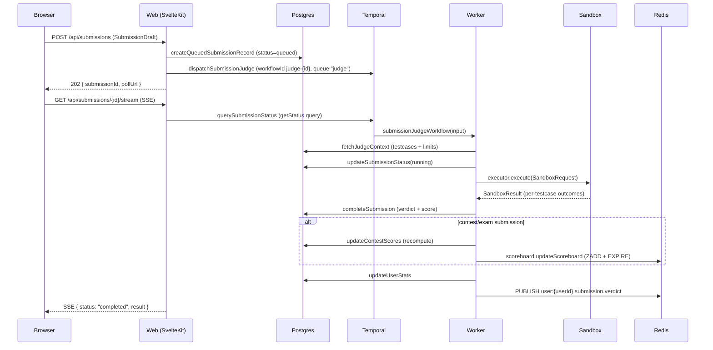
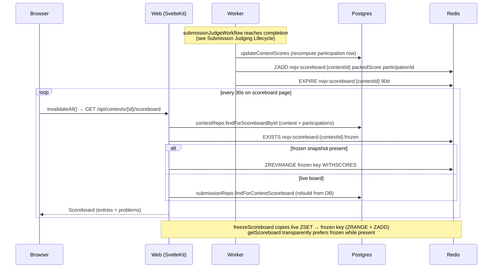

# Architecture Overview

NOJV is a production-oriented Online Judge platform. It supports competitive programming contests (ICPC/IOI scoring), course-based assessments, practice submissions, and plagiarism detection.

## Multi-Tier Architecture

```
┌─────────────────────────────────────────────────────────────────────┐
│ 1st Tier                                                            │
│                                                                     │
│  User Interface    Svelte components (browser rendering)            │
│                                                                     │
│  Presentation      SvelteKit server load / form actions (BFF)       │
│                    Temporal activities (worker-side controllers)    │
├─────────────────────────────────────────────────────────────────────┤
│ 2nd Tier                                                            │
│                                                                     │
│  Service           @nojv/domain                                     │
│                    contest/ course/ problem/ submission/ user/      │
│                    editorial/ plagiarism/ announcement/             │
├─────────────────────────────────────────────────────────────────────┤
│ 3rd Tier                                                            │
│                                                                     │
│  Persistence       @nojv/db (repositories, not raw Prisma client)   │
│                                                                     │
│  Data              PostgreSQL 18, Redis 8                           │
├─────────────────────────────────────────────────────────────────────┤
│ Infrastructure (cross-cutting, any layer may use)                   │
│                                                                     │
│  @nojv/core          Zod schemas, DTO types, enums, contracts       │
│  @nojv/redis         Pub/sub, cache, key registry, TTL policies     │
│  @nojv/job-dispatch  Temporal client wrapper, stable dispatch API   │
│  @nojv/storage       S3-compatible object storage (images)          │
│  tooling/            ESLint, Prettier, TypeScript configs           │
└─────────────────────────────────────────────────────────────────────┘
```

Dependency direction is strictly top-down: `UI → Presentation → Service → Persistence → Data`. Infrastructure is cross-cutting and may be used by any layer.

## System Domains

| Domain          | Purpose                                                                  |
| --------------- | ------------------------------------------------------------------------ |
| **Problems**    | Problem statements (i18n), testcase sets, templates, judge configuration |
| **Submissions** | Code submission, sandbox execution, verdict computation                  |
| **Contests**    | Timed competitions with scoreboard, freeze, IP lock, page lock           |
| **Courses**     | Course management, memberships, join tokens, assessments                 |
| **Auth**        | Email/password + OAuth (GitHub, Google), session management, roles       |
| **Plagiarism**  | Dolos-based AST similarity detection for assessments and contests        |
| **Stats**       | Per-user statistics: AC count, language distribution, daily activity     |

## Package Structure

```
packages/
  core/             Zod schemas, DTO types, enums, contracts (zero deps)
  db/               Prisma schema, migrations, repositories (depends: core)
  redis/            Connection, key registry, pub/sub, cache (depends: core)
  job-dispatch/     Temporal client wrapper, dispatch API (depends: core)
  storage/          S3-compatible object storage for images (depends: none)
  temporal/         Workflows + activities (depends: core, domain, redis)
  domain/           Business logic (depends: core, db, redis, job-dispatch)

apps/
  web/              SvelteKit BFF (depends: core, domain)
  worker/           Temporal worker boot (depends: core, temporal, db, redis)
  sandbox-runner/   Isolated sandbox (depends: core only)
```

### Dependency Graph

```
                    core
                   ↗  ↑  ↖
                 db  redis  job-dispatch   storage
                  ↖   ↑   ↗                 ↑
                   domain                   web
                  ↗       ↖
           temporal        web
              ↑
           worker
```

No cycles. `domain` → `job-dispatch` for dispatching workflows. `temporal` → `domain` for activity logic. `domain` never imports `temporal`.

### Dependency Rules

| Package          | May import                            | Must NOT import                   |
| ---------------- | ------------------------------------- | --------------------------------- |
| `core`           | (nothing)                             | everything                        |
| `db`             | `core`                                | domain, redis, job-dispatch       |
| `redis`          | `core`                                | domain, db, job-dispatch          |
| `job-dispatch`   | `core`                                | domain, db, redis, temporal       |
| `domain`         | `core`, `db`, `redis`, `job-dispatch` | temporal, web, worker             |
| `temporal`       | `core`, `domain`, `redis`             | db, job-dispatch, web             |
| `storage`        | (nothing)                             | everything                        |
| `web`            | `core`, `domain`, `storage`           | db, redis, job-dispatch, temporal |
| `worker`         | `core`, `temporal`, `db`, `redis`     | domain, job-dispatch, web         |
| `sandbox-runner` | `core`                                | everything else                   |

## Runtime Entry Points

### apps/web — SvelteKit BFF

Port 5173 (dev) / 3000 (production).

Responsibilities:

- Server-rendered pages with client hydration (User Interface tier)
- Server load functions and form actions as Presentation layer
- Session validation via better-auth
- Calls `@nojv/domain` for all business logic — **zero business logic in this layer**
- Role-based access control (platform + course roles)

Does NOT directly access: database, Redis, Temporal.

### apps/worker — Temporal Worker

Port 8080 (health check only).

Responsibilities:

- Registers Temporal workflows and activities
- Activities act as Presentation layer (worker-side controllers)
- Activities call `@nojv/domain` data functions for business logic
- Executes sandbox code in Docker or Kubernetes

Supports three deployment modes via `WORKER_MODE`:

- `all` — Both judge and platform task queues (default, for development)
- `judge` — Only sandbox-related activities (scales with submission load)
- `platform` — Only lifecycle and plagiarism activities (lightweight)

### apps/sandbox-runner — Isolated Execution Runtime

Runs inside a container with:

- `cap-drop ALL`, `no-new-privileges`, read-only rootfs, `tmpfs /tmp`
- Network isolation (`--network none`)
- PID, memory, CPU limits
- seccomp restrictions

Only depends on `@nojv/core` for the sandbox contract. Can be rewritten in any language.

## Shared Packages

### @nojv/core

Zod schemas and TypeScript types shared across all apps. Zero dependencies. Contains:

- Domain enums (languages, roles, statuses, verdicts)
- DTO type definitions (all domain functions return these)
- Validation schemas (problem, contest, course, submission)
- Judge pipeline stage definitions and configuration schemas
- Sandbox request/result interfaces and executor contract
- SSE event types and Redis connection parsing
- Shared event config schema (used by both Contest and CourseAssessment)

### @nojv/db

Prisma 7 schema, migrations, and **repository objects**. PostgreSQL with the `pg` adapter.

- Prisma client is internal — not exported from the package
- Only repositories are exported (one per domain entity)
- Domain layer accesses data exclusively through repositories

See [Database Schema](docs/DATABASE.md).

### @nojv/redis

Centralized Redis operations. Contains:

- Key registry — all Redis key patterns defined as functions
- Pub/sub — SSE event publishing and subscription
- Cache — domain-scoped get/set/del with TTL policies
- Cooldown — rate limiting for submissions and actions
- Scoreboard — contest ranking storage and retrieval

### @nojv/job-dispatch

Stable dispatch API wrapping Temporal client. Contains:

- `submitJudge()` — dispatch submission judge workflow
- `startContestLifecycle()` — dispatch contest lifecycle workflow
- `startAssessmentLifecycle()` — dispatch assessment lifecycle workflow
- `triggerPlagiarismCheck()` — dispatch Dolos plagiarism workflow
- `startRejudge()` — dispatch rejudge workflow

Domain and web layers never see Temporal internals (workflow IDs, task queues, gRPC).

### @nojv/storage

S3-compatible object storage via `@aws-sdk/client-s3`. Contains:

- Client factory — creates S3Client from environment variables
- Image operations — upload and delete problem images
- Path convention: `problems/{problemId}/images/{uuid}.{ext}`

Local dev uses MinIO (Docker). Production uses any S3-compatible service (GCS, R2, S3) — switch via env vars only.

### @nojv/temporal

Temporal workflow and activity definitions. Used only by `apps/worker`.

- Activities call `@nojv/domain` data functions for business logic
- Activities call `@nojv/redis` for event publishing
- Activities never dispatch workflows (no accidental recursion)

Workflows, task queues, and ID patterns:

| Workflow                      | Task Queue | Workflow ID pattern                   | Signal / Query                                |
| ----------------------------- | ---------- | ------------------------------------- | --------------------------------------------- |
| `submissionJudgeWorkflow`     | `judge`    | `judge-{submissionId}`                | Query: `getStatus`                            |
| `rejudgeWorkflow`             | `judge`    | `rejudge-{problemId}-{timestamp}`     | Query: `getProgress`                          |
| `contestLifecycleWorkflow`    | `platform` | `contest-lifecycle-{contestId}`       | Signal: `adminOverride` (`earlyEnd`/`extend`) |
| `assessmentLifecycleWorkflow` | `platform` | `assessment-lifecycle-{assessmentId}` | —                                             |
| `plagiarismCheckWorkflow`     | `platform` | `plagiarism-{targetType}-{targetId}`  | Query: `getProgress`                          |
| `examAutoCloseWorkflow`       | `platform` | `exam-auto-close-{examId}`            | Conflict: `TERMINATE_EXISTING` on re-dispatch |

Two task queues isolate failure domains and scale independently: `judge` handles submission execution (CPU/sandbox-bound); `platform` handles lifecycle timers, plagiarism, and notification fan-out. `WORKER_MODE` selects which to run (see [apps/worker](#appsworker--temporal-worker)).

### @nojv/domain

Single source of all business logic. Organized by domain:

- Each domain has `queries.ts` (read) and `commands.ts` (write)
- All functions return DTO types defined in `@nojv/core`
- Two function categories:
  - **Orchestration functions** — called by web, may dispatch workflows via job-dispatch
  - **Data functions** — called by temporal activities, pure DB + event operations

## Key Flows

The three sequence diagrams below walk through the most load-bearing runtime paths. Actor names are consistent across diagrams: `Browser` is the SvelteKit client, `Web` is the SvelteKit server (apps/web), `Temporal` is the Temporal service, `Worker` is a Temporal worker process (apps/worker) running judge or platform activities, `Sandbox` is the isolated sandbox-runner container, `Redis` is the shared Redis instance (pub/sub + scoreboard ZSETs), and `Postgres` is the primary database.

### Submission Judging Lifecycle

This is the end-to-end path from clicking "Submit" to seeing a verdict. The web layer only writes the queued row and dispatches a workflow — all real judging happens inside the Temporal workflow, which calls domain data functions through activities. The browser learns the final verdict by polling the submission workflow's `getStatus` query over SSE; a separate user-scoped SSE pub/sub channel (`user:{userId}`) also receives a best-effort verdict notification that the header toast listens to.



Edge cases: if the Temporal service is down, `dispatchSubmissionJudge` rejects and the submission stays in `queued` (no rollback); `createQueuedSubmissionRecord` has already committed. If the worker crashes mid-execution, Temporal retries the workflow up to `maximumAttempts: 3` from the last durable activity boundary. If Redis is down, `publishVerdict` swallows the error (best-effort), so the header toast never fires but the per-submission SSE stream still converges via the direct DB read.

### Exam Session Lifecycle

Exam sessions are mutually exclusive globally per user — the SvelteKit `handle` hook enforces that a student with an active session can only reach `/exams/{id}/**`. `startSessionWithGate` is idempotent on `(userId, examId)`, so a page refresh after `?/startExam` never duplicates the session; only the first call returns 201. Submissions within the exam reuse the standard judging flow (diagram above). Auto-close is a separate Temporal timer workflow keyed on `examId` that terminates any prior instance so re-publishing with a new `endsAt` correctly reschedules.

```mermaid
sequenceDiagram
    participant Browser
    participant Web as Web (SvelteKit)
    participant Postgres
    participant Temporal
    participant Worker

    Note over Temporal,Worker: Earlier: publishExam → dispatchExamAutoClose<br/>(workflowId exam-auto-close-{examId})

    Browser->>Web: POST /exams/{examId}?/startExam
    Web->>Postgres: startSessionWithGate (enroll check, gate window)
    Web->>Postgres: ExamSession upsert (ipPin, startedAt) + event "enter"
    Web-->>Browser: 201 (fresh) or 200 (idempotent re-entry)

    loop every ~30s while tab open
        Browser->>Web: POST /api/exam-sessions/{examId}/heartbeat
        Web->>Postgres: heartbeatWithThrottle (bump lastHeartbeatAt, throttle event insert)
    end

    Note over Browser,Web: handle hook blocks navigation outside /exams/{id}/**;<br/>attempted off-path request records "visibility_lost" event
    Browser->>Web: GET /courses/... (disallowed)
    Web->>Postgres: recordEvent("visibility_lost", {attemptedPath})
    Web-->>Browser: 302 → /exams/{examId}

    Browser->>Web: submit problem (see Submission Judging Lifecycle)

    alt student submits exam
        Browser->>Web: POST /exams/{examId}?/releaseSession (reason: "submitted")
        Web->>Postgres: endSession (endedAt, releaseReason, event "release")
        Web-->>Browser: 200
    else timer reaches endsAt
        Temporal->>Worker: examAutoCloseWorkflow fires after sleep(endsAt - now)
        Worker->>Postgres: closeActiveSessionsForExam (endedAt, reason "time_up", event "auto_close")
    end
```

Edge cases: if Temporal is down at publish time, the auto-close workflow is never scheduled and sessions will not self-close — students must manually end, or an instructor releases them. If the heartbeat request fails (network loss), the session's `lastHeartbeatAt` goes stale but the session stays active; instructor dashboards surface the gap. IP pin mismatch is enforced elsewhere in the submission path, not in heartbeat.

### Contest Scoreboard Update

A successful judge in contest context triggers `updateContestScores`, which recomputes the participant's score in Postgres and writes the packed score (for ICPC: `solved * 1e9 - penalty`) into a Redis ZSET keyed `nojv:scoreboard:{contestId}`. The public scoreboard page does **not** subscribe to a Redis pub/sub channel for live updates — it polls with `invalidateAll()` on a 30 s `setInterval`, and the server-side endpoint reads either the live ZSET or a frozen snapshot.



Edge cases: if Redis is down, `updateScoreboard` throws and propagates back through the activity — Temporal retries up to the activity retry policy, so the ZSET eventually converges. The read path falls back to Postgres (`buildScoreboard` from raw submissions) for the page render, so the scoreboard stays available even if Redis is unreachable. A bulk rejudge writes many `updateScoreboard` calls in a tight loop; each ZADD is idempotent.

## Related Docs

- [Product Sense](docs/PRODUCT_SENSE.md)
- [Frontend Surface](docs/FRONTEND.md)
- [Judge Pipeline](docs/JUDGE_PIPELINE.md)
- [Database Schema](docs/DATABASE.md)
- [Redis Architecture](docs/REDIS.md)
- [Security Requirements](docs/SECURITY.md)
- [Deployment Guide](docs/DEPLOYMENT.md)
