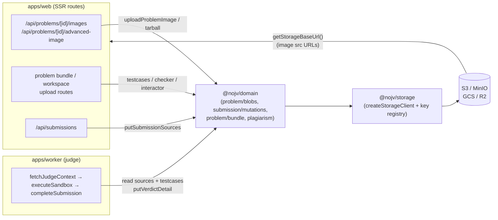
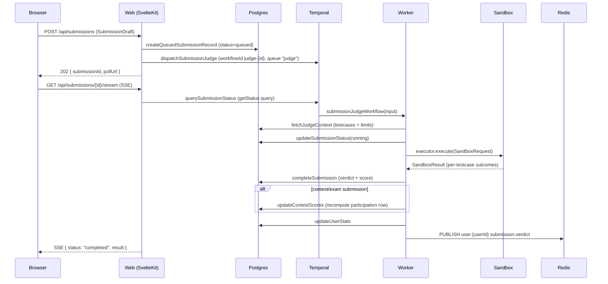

# Architecture Overview

NOJV is a production-oriented Online Judge platform. It supports competitive programming contests (ICPC/IOI scoring), course-based assessments, practice submissions, and plagiarism detection.

## Multi-Tier Architecture

```
┌─────────────────────────────────────────────────────────────────────┐
│ 1st Tier                                                            │
│                                                                     │
│  User Interface    Svelte components (browser rendering)            │
│                                                                     │
│  Presentation      SvelteKit server load / form actions (BFF)       │
│                    Temporal activities (apps/worker/src/activities/) │
├─────────────────────────────────────────────────────────────────────┤
│ 2nd Tier                                                            │
│                                                                     │
│  Service           @nojv/domain                                     │
│                    admin/ announcement/ assignment/ clarification/  │
│                    contest/ course/ editorial/ exam/ notification/  │
│                    plagiarism/ problem/ proctoring/ score-override/ │
│                    scoring/ shared/ submission/ user/               │
├─────────────────────────────────────────────────────────────────────┤
│ 3rd Tier                                                            │
│                                                                     │
│  Persistence       @nojv/db (repositories, not raw Prisma client)   │
│                                                                     │
│  Data              PostgreSQL 18, Redis 8                           │
├─────────────────────────────────────────────────────────────────────┤
│ Infrastructure (cross-cutting, any layer may use)                   │
│                                                                     │
│  @nojv/core          Zod schemas, DTO types, enums, contracts       │
│  @nojv/redis         Pub/sub, key registry, connection              │
│  @nojv/temporal      Temporal client + dispatch API + types         │
│  @nojv/storage       S3-compatible object storage (images)          │
│  tooling/            ESLint, Prettier, TypeScript configs           │
└─────────────────────────────────────────────────────────────────────┘
```

Dependency direction is strictly top-down: `UI → Presentation → Service → Persistence → Data`. Infrastructure is cross-cutting and may be used by any layer.

## System Domains

| Domain          | Purpose                                                                  |
| --------------- | ------------------------------------------------------------------------ |
| **Problems**    | Problem statements (i18n), testcase sets, templates, judge configuration |
| **Submissions** | Code submission, sandbox execution, verdict computation                  |
| **Contests**    | Timed competitions with scoreboard, freeze, IP lock, page lock           |
| **Courses**     | Course management, memberships, join tokens, assessments                 |
| **Auth**        | Email/password + OAuth (GitHub, Google), session management, roles       |
| **Plagiarism**  | Dolos-based AST similarity detection for assessments and contests        |
| **Stats**       | Per-user statistics: AC count, language distribution, daily activity     |

## Package Structure

```
packages/
  core/             Zod schemas, DTO types, enums, contracts (zero deps)
  db/               Prisma schema, migrations, repositories (depends: core; +redis, storage in seed/ops scripts only)
  redis/            Connection, key registry, pub/sub (depends: core)
  storage/          S3-compatible object storage for images (depends: none)
  temporal/         Temporal client + dispatch API + workflows + task queue constants (depends: core)
  domain/           Business logic (depends: core, db, redis, temporal)

apps/
  web/              SvelteKit BFF (depends: core, domain)
  worker/           Temporal worker boot + activity implementations (depends: core, temporal, domain, db, redis, storage)
  sandbox-runner/   Isolated sandbox (depends: core only)
```

### Dependency Graph

```
                    core
                   ↗  ↑  ↖↘
                 db  redis  temporal   storage
                  ↖   ↑   ↗            ↑
                   domain ─────────────┤
                  ↗       ↘            │
              web          worker ─────┘
```

No cycles. `domain` → `temporal` for dispatch helpers and Temporal client. `worker` → `domain` for activity business logic. Activities live in `apps/worker/src/activities/` so `temporal` does NOT need to depend on `domain` — that's what previously forced the `@nojv/job-dispatch` split.

### Dependency Rules

| Package          | May import                                               | Must NOT import                                                           |
| ---------------- | -------------------------------------------------------- | ------------------------------------------------------------------------- |
| `core`           | (nothing)                                                | everything                                                                |
| `db`             | `core` ¶                                                 | domain, temporal; redis/storage from `src/`                               |
| `redis`          | `core`                                                   | domain, db, temporal                                                      |
| `domain`         | `core`, `db`, `redis`, `storage` \*, `temporal`          | `@nojv/temporal/workflows`, web, worker                                   |
| `temporal`       | `core`                                                   | db, redis, domain, web, worker (must stay self-contained to avoid cycles) |
| `storage`        | (none of `@nojv/*`)                                      | everything `@nojv/*`                                                      |
| `web`            | `core`, `domain`, `storage` ‖, `redis` †, `db` ‡         | temporal/workflows                                                        |
| `worker`         | `core`, `temporal`, `domain`, `db`, `redis`, `storage` § | web                                                                       |
| `sandbox-runner` | `core`                                                   | everything else                                                           |

\* `domain` reaches into `storage` from `problem/blobs.ts` to write
problem image blobs alongside the DB row inside the same transaction.
The transaction would lose atomicity if storage writes lived in `web`.

† `web` uses `@nojv/redis` directly for the SSE subscriber
(`api/events/stream`) and for `RateLimiterRedis` in
`shared/rate-limiter.ts`. Both want the raw Redis client, not a
domain-shaped wrapper. These two files are the only exceptions —
everything else goes through `@nojv/domain`. The
`no-restricted-imports` ESLint rule in `apps/web/eslint.config.mjs`
enforces this and lists the exact allow-list of files.

‡ `web` uses `@nojv/db` only via `prismaAdapterClient` from
`src/lib/auth.server.ts`, where the better-auth Prisma adapter
requires a raw `PrismaClient`. All other route / loader / action code
goes through `@nojv/domain`; the ESLint rule above blocks new direct
`@nojv/db` imports outside `auth.server.ts`.

‖ `web` may use `@nojv/storage` from inside `src/lib/server/storage/*`
adapters (currently `avatar.ts`, `problem-image.ts`,
`user-content-image.ts`, `advanced-image.ts`). Routes, loaders, and
actions must call those adapters or go through `@nojv/domain` (e.g.
`problemDomain.hydrateTestcaseSets`) — they must not import
`@nojv/storage` directly. The ESLint rule above enforces this too.

§ `worker` pulls problem-image tarballs from object storage in
`advanced-mode-executor.ts`. Adding a domain hop would require moving
the cache logic into `@nojv/domain`, which is not worth it for one
caller.

¶ `@nojv/db` declares `@nojv/redis` and `@nojv/storage` as runtime
dependencies, but only its seed and one-off ops scripts
(`prisma/seed.ts`, `prisma/seeds/*`, `prisma/scripts/*`) import them —
to open a Redis connection (closed at the end of the seed) and upload
demo problem blobs. The shipped
library (`src/` → `dist/`) imports neither, so the layer graph above
holds for everything that runs in production request paths. They stay
in `dependencies` (not `devDependencies`) because the seed runs inside
the minimal `migrator` image, which installs `@nojv/db` only.

## Runtime Entry Points

### apps/web — SvelteKit BFF

Port 5173 (dev) / 3000 (production).

Responsibilities:

- Server-rendered pages with client hydration (User Interface tier)
- Server load functions and form actions as Presentation layer
- Session validation via better-auth
- Calls `@nojv/domain` for all business logic — **zero business logic in this layer**
- Role-based access control (platform + course roles)
- Serves OpenAPI 3.1 documents (`/api/openapi.{public,internal}.json`) and Scalar reference pages (`/docs`, `/docs/internal`) describing the existing API surface — documentation-only, assembled in `src/lib/server/openapi/` (internal paths split per-tag under `openapi/internal/`); a unit test (`tests/unit/openapi-contract.test.ts`) guards the docs against route drift

Directly accesses: Redis (SSE subscriber + `RateLimiterRedis`), DB
(better-auth adapter + a few repository-direct routes). See the table
above for why. Does NOT directly access Temporal — everything goes
through `@nojv/domain`, which re-exports the dispatch helpers from `@nojv/temporal`.

### apps/worker — Temporal Worker

Port 8080 (health check only).

Responsibilities:

- Registers Temporal workflows and activities
- Activities act as Presentation layer (worker-side controllers)
- Activities call `@nojv/domain` data functions for business logic
- Executes sandbox code in Docker or Kubernetes

Supports three deployment modes via `WORKER_MODE`:

- `all` — Both judge and platform task queues (default, for development)
- `judge` — Only sandbox-related activities (scales with submission load)
- `platform` — Only lifecycle and plagiarism activities (lightweight)

### apps/sandbox-runner — Isolated Execution Runtime

Runs inside a container with:

- `cap-drop ALL`, `no-new-privileges`, read-only rootfs, `tmpfs /tmp`
- Network isolation (`--network none`)
- PID, memory, CPU limits
- seccomp restrictions

Only depends on `@nojv/core` for the sandbox contract. Can be rewritten in any language.

## Shared Packages

### @nojv/core

Zod schemas and TypeScript types shared across all apps. Zero dependencies. Contains:

- Domain enums (languages, roles, statuses, verdicts)
- DTO type definitions (all domain functions return these)
- Validation schemas (problem, contest, course, submission)
- Judge pipeline stage definitions and configuration schemas
- Sandbox request/result interfaces and executor contract
- SSE event types and Redis connection parsing
- Shared event config schema (used by both Contest and Assessment)

### @nojv/db

Prisma 7 schema, migrations, and **repository objects**. PostgreSQL with the `pg` adapter.

- Prisma client is internal — not exported from the package
- Only repositories are exported (one per domain entity)
- Domain layer accesses data exclusively through repositories

See [Database Schema](./DATABASE.md).

### @nojv/redis

Centralized Redis operations. Contains:

- Connection — shared `ioredis` client factory and SSE subscriber factory
- Key registry — all Redis key patterns defined as functions
- Pub/sub — SSE event publishing and subscription

Rate limiting lives in `apps/web/src/lib/server/shared/rate-limiter.ts`
(`RateLimiterRedis` against the raw client), not in this package.

### @nojv/storage

S3-compatible object storage via `@aws-sdk/client-s3`. Env is centralized in
`storageEnvSchema` (`src/env.ts`); `createStorageClient()` validates the
credentials (`S3_ENDPOINT` / `S3_ACCESS_KEY` / `S3_SECRET_KEY`) at client
creation. Contains:

- **Client factory** — `createStorageClient()` + `getStorageBaseUrl()`.
- **Images** — problem images, user-content images, user avatars (served via the public base URL).
- **Advanced-mode tarballs** — `special_env` Docker image tarballs (upload / download / delete).
- **Blobs** — submission sources, judge verdict detail, testcase input/output, workspace files, checker / interactor scripts.
- **Key registry** — `problemPrefix` / `submissionPrefix` / `submissionSourcePrefix` / `testcase*Key` / `workspaceFileKey` / `checkerKey` / `interactorKey` so producers and consumers agree on paths.

Local dev uses MinIO (Docker). Production uses any S3-compatible service (GCS, R2, S3) — switch via env vars only.

#### Storage data flow



**Producers** write under stable key prefixes: problem images
(`problems/{id}/images/{uuid}.{ext}`), submission sources
(`submissionSourcePrefix`), verdict detail (`verdictDetailStorageKey`),
testcases / workspace / checker / interactor (`testcase*Key` etc.).
**Consumers** read the same keys: the worker reads sources + testcases to feed
the sandbox and writes verdict detail; the web layer reads verdict detail for
the submission view and resolves image `src` URLs via `getStorageBaseUrl()`;
plagiarism reads submission sources. The shared key registry is the single
source of truth that keeps producer and consumer paths aligned.

### @nojv/temporal

Temporal client, dispatch API, task queue constants, and Temporal input/output types. Intentionally lean: zero `@nojv/domain` import so `@nojv/domain` can depend on it without forming a cycle.

- Exports `getTemporalClient` / `closeTemporalClient`, `dispatch*` functions, workflow `query*` helpers, task queue constants, and Temporal input/output types.
- Workflow definitions live in `apps/worker/src/workflows/` (loaded into Temporal's workflow sandbox at worker start-up).
- Activity implementations live in `apps/worker/src/activities/` — they import `@nojv/domain` for business logic and `@nojv/redis` for event publishing.
- Activities never dispatch workflows (no accidental recursion).
- `domain/admin/index.ts` is the only file outside `apps/worker` that touches the raw `getTemporalClient`, to expose Temporal connection state on the admin healthz endpoint.

Dispatch helpers exposed at the root entry:

- `dispatchSubmissionJudge()` — submission judge workflow
- `dispatchContestLifecycle()` — contest lifecycle workflow
- `dispatchPlagiarismCheck()` — Dolos plagiarism workflow
- `dispatchRejudge()` — rejudge workflow
- `dispatchExamAutoClose()` — exam auto-close timer workflow
- `querySubmissionStatus()` / `queryRejudgeProgress()` / `queryPlagiarismStatus()` — workflow queries

Workflows, task queues, and ID patterns:

| Workflow                    | Task Queue | Workflow ID pattern                                                               | Signal / Query                                    |
| --------------------------- | ---------- | --------------------------------------------------------------------------------- | ------------------------------------------------- |
| `submissionJudgeWorkflow`   | `judge`    | `judge-{submissionId}`                                                            | Query: `getStatus`                                |
| `rejudgeWorkflow`           | `judge`    | `rejudge-{submissionId\|examId\|contestId\|assessmentId\|problemId}-{uuid}`       | Query: `getProgress`                              |
| `contestLifecycleWorkflow`  | `platform` | `contest-lifecycle-{contestId}`                                                   | Reschedule via re-dispatch (`TERMINATE_EXISTING`) |
| `plagiarismCheckWorkflow`   | `platform` | `plagiarism-{targetType}-{targetId}`                                              | Query: `getPlagiarismStatus`                      |
| `examAutoCloseWorkflow`     | `platform` | `exam-auto-close-{examId}` (id-reuse policy: `TERMINATE_EXISTING` on re-dispatch) | —                                                 |
| `submissionSweeperWorkflow` | `platform` | `submission-pending-sweeper` (singleton, `cronSchedule: "* * * * *"`)             | —                                                 |

The parent `rejudgeWorkflow` ID carries a `randomUUID()` suffix (not a
timestamp) so concurrent rejudges of the same scope never collide; each
spawned child judge uses `rejudge-{submissionId}-{Date.now()}`.

The `submissionSweeperWorkflow` is a singleton cron started once via
`ensureSubmissionSweeper()`; every minute it runs the
`sweepStaleSubmissions` activity, which terminates submissions stuck in
`queued`/`running` past the configured timeout and returns the daily
attempt (see [Reliability Invariants](../operations/RELIABILITY.md)).

Two task queues isolate failure domains and scale independently: `judge` handles submission execution (CPU/sandbox-bound); `platform` handles lifecycle timers, plagiarism, the stale-submission sweeper, and notification fan-out. `WORKER_MODE` selects which to run (see [apps/worker](#appsworker--temporal-worker)).

### @nojv/domain

Single source of all business logic. Organized by domain:

- Each domain has `queries.ts` (read) and `commands.ts` (write)
- All functions return DTO types defined in `@nojv/core`
- Two function categories:
  - **Orchestration functions** — called by web, may dispatch workflows via the `@nojv/temporal` root entry (dispatch helpers)
  - **Data functions** — called by temporal activities, pure DB + event operations

## Key Flows

The three sequence diagrams below walk through the most load-bearing runtime paths. Actor names are consistent across diagrams: `Browser` is the SvelteKit client, `Web` is the SvelteKit server (apps/web), `Temporal` is the Temporal service, `Worker` is a Temporal worker process (apps/worker) running judge or platform activities, `Sandbox` is the isolated sandbox-runner container, `Redis` is the shared Redis instance (pub/sub), and `Postgres` is the primary database.

### Submission Judging Lifecycle

This is the end-to-end path from clicking "Submit" to seeing a verdict. The web layer only writes the queued row and dispatches a workflow — all real judging happens inside the Temporal workflow, which calls domain data functions through activities. The browser learns the final verdict by polling the submission workflow's `getStatus` query over SSE; a separate user-scoped SSE pub/sub channel (`user:{userId}`) also receives a best-effort verdict notification that the header toast listens to.



Edge cases: if the Temporal service is down, `dispatchSubmissionJudge` rejects and the submission stays in `queued` (no rollback); `createQueuedSubmissionRecord` has already committed. If the worker crashes mid-execution, Temporal retries the workflow up to `maximumAttempts: 3` from the last durable activity boundary. If Redis is down, `publishVerdict` swallows the error (best-effort), so the header toast never fires but the per-submission SSE stream still converges via the direct DB read.

### Exam Session Lifecycle

Exam sessions are mutually exclusive globally per user — the SvelteKit `handle` hook enforces that a student with an active session can only reach `/exams/{id}/**`. `startSessionWithGate` is idempotent on `(userId, examId)`, so a page refresh after `?/startExam` never duplicates the session; only the first call returns 201. Submissions within the exam reuse the standard judging flow (diagram above). Auto-close is a separate Temporal timer workflow keyed on `examId` that terminates any prior instance so re-publishing with a new `endsAt` correctly reschedules.

```mermaid
sequenceDiagram
    participant Browser
    participant Web as Web (SvelteKit)
    participant Postgres
    participant Temporal
    participant Worker

    Note over Temporal,Worker: Earlier: publishExam → dispatchExamAutoClose<br/>(workflowId exam-auto-close-{examId})

    Browser->>Web: POST /exams/{examId}?/startExam
    Web->>Postgres: startSessionWithGate (enroll check, gate window)
    Web->>Postgres: ExamSession upsert (ipPin, startedAt) + event "enter"
    Web-->>Browser: 201 (fresh) or 200 (idempotent re-entry)

    loop every ~30s while tab open
        Browser->>Web: POST /api/exam-sessions/{examId}/heartbeat
        Web->>Postgres: heartbeatWithThrottle (bump lastHeartbeatAt, throttle event insert)
    end

    Note over Browser,Web: handle hook blocks navigation outside /exams/{id}/**;<br/>attempted off-path request records "visibility_lost" event
    Browser->>Web: GET /courses/... (disallowed)
    Web->>Postgres: recordEvent("visibility_lost", {attemptedPath})
    Web-->>Browser: 302 → /exams/{examId}

    Browser->>Web: submit problem (see Submission Judging Lifecycle)

    alt student submits exam
        Browser->>Web: POST /exams/{examId}?/releaseSession (reason: "submitted")
        Web->>Postgres: endSession (endedAt, releaseReason, event "release")
        Web-->>Browser: 200
    else timer reaches endsAt
        Temporal->>Worker: examAutoCloseWorkflow fires after sleep(endsAt - now)
        Worker->>Postgres: closeActiveSessionsForExam (endedAt, reason "time_up", event "auto_close")
    end
```

Edge cases: if Temporal is down at publish time, the auto-close workflow is never scheduled and sessions will not self-close — students must manually end, or an instructor releases them. If the heartbeat request fails (network loss), the session's `lastHeartbeatAt` goes stale but the session stays active; instructor dashboards surface the gap. IP pin mismatch is enforced elsewhere in the submission path, not in heartbeat.

### Contest Scoreboard Update

A successful judge in contest context triggers `updateContestScores`, which recomputes the participant's score in Postgres. There is no separate scoreboard store: the ranking is computed on read, directly from Postgres via `buildScoreboard`. For live updates the page opens an SSE stream (`/contests/{id}/scoreboard/stream`, which subscribes to the Redis `nojv:contest:{id}` channel); a successful contest judge calls `publishScoreboardUpdate` — throttled to once per 10 s per contest via the `nojv:sb-throttle:{id}` key — to nudge connected viewers to re-fetch. A 30 s `invalidateAll()` poll runs as the fallback when SSE is unavailable, and the server-side endpoint always rebuilds the ranking from the contest's participations and submissions.

```mermaid
sequenceDiagram
    participant Browser
    participant Web as Web (SvelteKit)
    participant Worker
    participant Redis
    participant Postgres

    Note over Worker: submissionJudgeWorkflow reaches completion<br/>(see Submission Judging Lifecycle)
    Worker->>Postgres: updateContestScores (recompute participation row)
    Worker->>Redis: publishScoreboardUpdate (nojv:contest channel, 10s throttle)
    Redis-->>Browser: SSE scoreboard:update nudge (via /scoreboard/stream)
    Browser->>Web: invalidateAll() → GET /api/contests/{id}/scoreboard

    loop every 30s on scoreboard page (SSE-unavailable fallback)
        Browser->>Web: invalidateAll() → GET /api/contests/{id}/scoreboard
        Web->>Postgres: contestRepo.findForScoreboardById (contest + participations + submissions)
        Web->>Web: buildScoreboard (rank in-process; ICPC packs solved/penalty, IOI sums best subtask scores)
        Note over Web: when frozenBoard is set, buildScoreboard filters out<br/>submissions after frozenAt so the public board stops at the freeze point
        Web-->>Browser: Scoreboard (entries + problems)
    end
```

Edge cases: the scoreboard has no separate cache to fall stale or diverge — it is always computed from the current Postgres rows, so it stays available and consistent as long as Postgres is reachable. Freeze is purely a read-time filter driven by the `Contest.frozenBoard` / `Contest.frozenAt` columns: while frozen, `buildScoreboard` ignores submissions newer than `frozenAt`, so the public board holds at the freeze point while staff can still see the live ranking. A bulk rejudge only rewrites participation rows in Postgres; the next scoreboard read recomputes from scratch.

## Related Docs

- [Product Sense](../product/PRODUCT_SENSE.md)
- [Frontend Surface](./FRONTEND.md)
- [Judge Pipeline](./JUDGE_PIPELINE.md)
- [Database Schema](./DATABASE.md)
- [Redis Architecture](./REDIS.md)
- [Security Requirements](../operations/SECURITY.md)
- [Deployment Guide](../operations/DEPLOYMENT.md)
