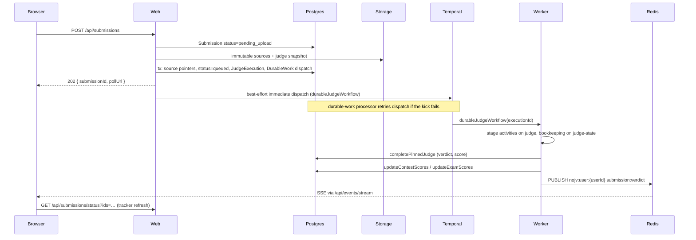

# Architecture Overview

System map for NOJV: runtime processes, workspace package boundaries, Temporal
orchestration (task queues, workflows, workflow IDs) and the main cross-process
flows. Judge internals live in [Judge Pipeline](./JUDGE_PIPELINE.md); schema in
[Database Schema](./DATABASE.md); keys and channels in [Redis](./REDIS.md).

## Key code

- `apps/web/` — SvelteKit BFF; `src/lib/server/domain-orchestration.ts` wires Temporal into the application port
- `apps/worker/src/worker-app.ts` — worker boot, task-queue registration, startup singletons
- `apps/worker/src/workflows/index.ts` — every registered workflow
- `apps/worker/src/activities/{judge-bundle,platform-bundle}.ts` — activities per queue
- `apps/worker/src/activities/durable-work-registry.ts` — outbox work kinds and handlers
- `packages/temporal/src/{dispatch,task-queues,orchestration-adapter}.ts` — start/query helpers, queue names, port adapter
- `packages/application/src/shared/orchestration.ts` — `DomainOrchestrationAdapter` port
- `packages/application/src/index.ts` — domain namespaces (`problemDomain`, `submissionDomain`, …)
- `tests/unit/infra/package-boundaries.test.ts` — enforces the package import rules below

## Layers

| Layer          | Where                                                                    | Owns                                               |
| -------------- | ------------------------------------------------------------------------ | -------------------------------------------------- |
| UI             | Svelte components in `apps/web/src/lib/components`, `routes/**/*.svelte` | Rendering; may only `import type` from application |
| Presentation   | SvelteKit `load` / actions / `+server.ts`; worker activities             | Transport, auth wiring, input parsing              |
| Application    | `@nojv/application`                                                      | All business rules, authorization, transactions    |
| Persistence    | `@nojv/db` repositories                                                  | Prisma queries; raw client only for better-auth    |
| Infrastructure | `@nojv/core`, `redis`, `storage`, `temporal`, `mailer`, `sandbox-docker` | Contracts, connections, key registries, dispatch   |
| Data           | PostgreSQL 18, Redis 8, S3-compatible storage, Temporal                  | PostgreSQL is the source of truth (DAT-10)         |

Layering rationale: ENG-02, DAT-01, DAT-14. Per-package responsibilities and
public entries are in each package README ([index](../../packages/README.md)).

## Dependency Rules

No package may import an app. `@nojv/application` reaches Temporal only through
the `DomainOrchestrationAdapter` port; `apps/web` and `apps/worker` call
`configureDomainOrchestration(buildDomainOrchestrationAdapter())` at startup.

| Package          | May import (`@nojv/*`)                                                                  | Must not import                                          |
| ---------------- | --------------------------------------------------------------------------------------- | -------------------------------------------------------- |
| `core`           | none (external libraries such as `zod`)                                                 | any `@nojv/*`                                            |
| `db`             | `core` from `src/`; `storage` only in `prisma/seeds/` and `prisma/scripts/`             | application, mailer, temporal, redis; storage in `src/`  |
| `redis`          | `core`                                                                                  | everything else                                          |
| `storage`        | `core`                                                                                  | everything else                                          |
| `temporal`       | `core`                                                                                  | everything else (keeps workflows/activities out)         |
| `mailer`         | none                                                                                    | any `@nojv/*`                                            |
| `sandbox-docker` | none                                                                                    | any `@nojv/*`                                            |
| `application`    | `core`, `db`, `redis`, `storage`, `mailer`                                              | `@sveltejs/kit`, `@temporalio/*`, `@nojv/temporal`, apps |
| `web`            | `core`, `application`, `mailer`; `temporal`/`storage`/`redis`/`db` per exceptions below | worker, workflow code                                    |
| `worker`         | all packages                                                                            | web                                                      |
| `sandbox-runner` | `core`                                                                                  | everything else (JDG-18)                                 |

`apps/web` exceptions, enforced by `no-restricted-imports` in
`apps/web/eslint.config.mjs` (the source of truth for the allow-list):

| Package          | Allowed only in                                                                                                                                                      |
| ---------------- | -------------------------------------------------------------------------------------------------------------------------------------------------------------------- |
| `@nojv/temporal` | `src/lib/server/domain-orchestration.ts`                                                                                                                             |
| `@nojv/db`       | `src/lib/auth.server.ts` (better-auth Prisma adapter via `prismaAdapterClient`)                                                                                      |
| `@nojv/redis`    | `src/lib/auth.server.ts`, `src/lib/server/shared/{rate-limiter,sse-hub}.ts`, `src/routes/api/events/stream/+server.ts`, `src/routes/**/scoreboard/stream/+server.ts` |
| `@nojv/storage`  | `src/lib/server/storage/**` adapters (avatar, problem/user-content/remote images)                                                                                    |

Svelte components (`src/lib/components/**`) may not import `db`, `redis` or
`storage`, and may only `import type` from `@nojv/application`.

`@nojv/application` writes object-storage bytes before the database commit:
uploads are guarded first, then `commitStoragePointerSwap` records object
ownership in the same transaction as the business rows; durable cleanup reclaims
abandoned objects (DAT-06, PRB-04).

## Runtime processes

| Process          | Port                       | Role                                                                                               |
| ---------------- | -------------------------- | -------------------------------------------------------------------------------------------------- |
| `apps/web`       | 5173 dev / 3000 prod       | SSR pages, form actions, `/api/**`, SSE, better-auth; OpenAPI docs at `/docs` and `/docs/internal` |
| `apps/worker`    | 8080 (`PORT`, health only) | Temporal workers; runs sandboxes via Docker or Kubernetes (`EXECUTION_BACKEND`)                    |
| `sandbox-runner` | none                       | Runs untrusted code inside the hardened sandbox; see [Security](../operations/SECURITY.md)         |

The OpenAPI documents (`/api/openapi.{public,internal}.json`) describe existing
routes only; they are assembled in `apps/web/src/lib/server/openapi/` and guarded
against route drift by `tests/unit/openapi-contract.test.ts` (ENG-05).

### Worker modes and task queues

`WORKER_MODE` selects which Temporal workers a process runs. Helm deploys
`nojv-worker` (`judge`) and `nojv-worker-platform` (`platform`); `all` is for
development.

| Queue         | Served in mode    | Worker shape                                                                                                     | Work                                                                              |
| ------------- | ----------------- | ---------------------------------------------------------------------------------------------------------------- | --------------------------------------------------------------------------------- |
| `judge`       | `judge`, `all`    | Workflows + activities; `WORKER_CONCURRENCY` slots, or resource-based tuner when `WORKER_MIN_CONCURRENCY` is set | Judge workflows; only sandbox stage activities (one slot = one sandbox stage)     |
| `judge-state` | `judge`, `all`    | Activity-only, 16 fixed slots                                                                                    | Judge bookkeeping activities (state, verdict commit, scoreboard nudge)            |
| `platform`    | `platform`, `all` | Workflows + activities; `WORKER_CONCURRENCY` slots                                                               | Lifecycle timers, plagiarism, durable work, sweeper, score effects, notifications |

Judge and platform workers cache at most 32 workflows and run at most 8 workflow
tasks concurrently. Queue capacity and priority: see
[Judge Pipeline](./JUDGE_PIPELINE.md) and JDG-12/13.

On `platform`/`all` startup the worker ensures the three cron singletons, then
runs `sweepStaleSubmissions()` and `recoverSystemErrorSubmissions()` once.
`judge` mode with `EXECUTION_BACKEND=kubernetes` refuses to start unless the
sandbox runtime and NetworkPolicy probes pass (JDG-20).

## Temporal orchestration

Rules: all async work runs in Temporal (DAT-13); workflow inputs carry IDs, not
blobs (DAT-16); workflow code changes use `patched()` (DAT-15); cron processors
are a cron parent awaiting a continue-as-new child (DAT-19).

| Workflow                                     | Queue      | Workflow ID                                     | Start / notes                                                                                                      |
| -------------------------------------------- | ---------- | ----------------------------------------------- | ------------------------------------------------------------------------------------------------------------------ |
| `durableJudgeWorkflow`                       | `judge`    | `judge-execution-{executionId}-{recoveryEpoch}` | `dispatchJudgeExecution`; `REJECT_DUPLICATE`; carries priority/fairness keys; state lives in `JudgeExecution` rows |
| `judgeCleanupWorkflow`                       | `judge`    | `judge-cleanup-{leaseToken}`                    | `dispatchJudgeCleanup`; `ALLOW_DUPLICATE_FAILED_ONLY`                                                              |
| `contestLifecycleWorkflow`                   | `platform` | `contest-lifecycle-{contestId}`                 | `ensure/replace/cancelContestLifecycle`; publishes `contest:starting` / `contest:ending`                           |
| `examAutoCloseWorkflow`                      | `platform` | `exam-auto-close-{examId}`                      | `ensure/replace/cancelExamAutoClose`; closes active sessions at `endsAt`                                           |
| `assignmentDueSoonWorkflow`                  | `platform` | `assignment-due-soon-{assignmentId}`            | `ensure/replace/cancelAssignmentDueSoon`; lead-day reminders (DAT-18)                                              |
| `plagiarismCheckWorkflow`                    | `platform` | `plagiarism-{targetType}-{targetId}`            | `dispatchPlagiarismCheck`; `TERMINATE_EXISTING` on conflict (ASM-23)                                               |
| `registryGarbageCollectWorkflow`             | `platform` | `registry-gc`                                   | `dispatchRegistryGarbageCollect`; singleton, reports `alreadyRunning` (OPS-10)                                     |
| `submissionSweeperWorkflow`                  | `platform` | `submission-pending-sweeper`                    | Cron `* * * * *`; ensured by the platform worker                                                                   |
| `durableWorkProcessorWorkflow`               | `platform` | `durable-work-processor`                        | Cron `* * * * *`; runs `durableWorkWorkflow` child                                                                 |
| `lifecycleReconcilerProcessorWorkflow`       | `platform` | `lifecycle-timer-reconciler`                    | Cron `*/5 * * * *`; runs `lifecycleReconcilerWorkflow` child; re-ensures timers and missed judge dispatch          |
| `submissionJudgeWorkflow`, `rejudgeWorkflow` | `judge`    | `judge-{submissionId}`, `rejudge-{uuid}`        | Legacy; registered only so persisted histories replay. New work never starts them                                  |

Lifecycle timers (`contest`, `exam`, `assignment`) are reconciled, not blindly
restarted: each start carries `scheduleRevision` and `timerFingerprint` in the
memo, and `ensure` / `replace` / `cancel` compare them with the running
execution before keeping, terminating or starting (`lifecycle-reconciliation.ts`).

### Durable work outbox

`DurableWork` rows (`@@unique([kind, dedupeKey])`) are written in the same
transaction as the business change and executed by `durableWorkWorkflow` through
`durable-work-registry.ts`. Current kinds: judge execution dispatch
(`submission.execution.dispatch`), rejudge dispatch, exam credential email,
notification SSE and email, exam score convergence, lifecycle cancellation and
storage object cleanup. Handlers must be idempotent; see
[Reliability](../operations/RELIABILITY.md).

### Rejudge

Teacher rejudges are database operations, not Temporal workflows: the operation
ID is `rejudge-{uuid}`, each target gets a new `JudgeExecution` generation
linked to that operation, and a durable-work row dispatches them as background
executions. Behavior: [Judge Pipeline](./JUDGE_PIPELINE.md),
JDG-10, PRB-18, DAT-17.

## Key flows

### Submission judging

```mermaid
sequenceDiagram
    participant Browser
    participant Web
    participant Postgres
    participant Storage
    participant Temporal
    participant Worker
    participant Redis

    Browser->>Web: POST /api/submissions
    Web->>Postgres: Submission status=pending_upload
    Web->>Storage: immutable sources + judge snapshot
    Web->>Postgres: tx: source pointers, status=queued, JudgeExecution, DurableWork dispatch
    Web-->>Browser: 202 { submissionId, pollUrl }
    Web->>Temporal: best-effort immediate dispatch (durableJudgeWorkflow)
    Note over Postgres,Temporal: durable-work processor retries dispatch if the kick fails
    Temporal->>Worker: durableJudgeWorkflow(executionId)
    Worker->>Worker: stage activities on judge, bookkeeping on judge-state
    Worker->>Postgres: completePinnedJudge (verdict, score)
    Worker->>Postgres: updateContestScores / updateExamScores
    Worker->>Redis: PUBLISH nojv:user:{userId} submission:verdict
    Redis-->>Browser: SSE via /api/events/stream
    Browser->>Web: GET /api/submissions/status?ids=… (tracker refresh)
```

- Upload failure after the intention row marks the submission `system_error`;
  guarded orphan objects are reclaimed by durable cleanup.
- Per-student order and priority come from `executeJudgeExecutionDispatch` and
  Temporal priority keys; see [Judge Pipeline](./JUDGE_PIPELINE.md).
- The browser tracker (`apps/web/src/lib/services/submission-tracker.ts`) polls
  `/api/submissions/status` and `/api/submissions/pending`; the SSE verdict event
  only wakes it, so a Redis outage delays but never loses results.
- Infrastructure faults never become student verdicts (JDG-09, JDG-11).

### Exam session

- `startExam` action → `examDomain.session.startSessionWithGate`: enrollment and
  gate checks, one active `ActiveExamSession` per user, idempotent per
  `(userId, examId)`.
- `hooks.server.ts` confines a user with an active session to `/exams/{examId}/**`
  and records `visibility_lost` for blocked navigation (ASM-19); IP rules are
  enforced on every request (ASM-20).
- Session ends by `releaseSession` (student hand-in), instructor release, or
  `examAutoCloseWorkflow` at `endsAt` (`time_up`, `auto_close` event).
- Spec: [exams](../features/exams.md); security: [Security](../operations/SECURITY.md).

### Contest scoreboard

A contest verdict runs `updateContestScores` (platform queue) and then
`publishScoreboardUpdate` (judge-state queue), which publishes a throttled
`scoreboard:update` on `nojv:contest:{contestId}`. The scoreboard page listens
on `/contests/{contestId}/scoreboard/stream`, re-fetches via
`invalidate("contest:scoreboard")`, and polls every 30 s as fallback.
`contestDomain.getScoreboard` computes from PostgreSQL with a short Redis cache;
freeze is a read-time filter on `frozenBoard` / `frozenAt` / `scoreboardMode`.
Cache and lease details: [Redis](./REDIS.md); rationale DAT-11.

### Object storage

`@nojv/storage` (S3-compatible: MinIO locally, GCS/R2/S3 in production) holds
submission sources and verdict detail, testcases, workspace files,
checker/interactor programs, judge snapshots and stage results, and images.
Keys come only from `packages/storage/src/keys.ts`; rows store verified
pointers (size + SHA-256). Images are served same-origin through
`/api/storage/{problem-images,user-content-images,avatars}/…`. Env:
`S3_ENDPOINT`, `S3_ACCESS_KEY`, `S3_SECRET_KEY`, `S3_BUCKET`, `S3_REGION`
(`packages/storage/src/env.ts`); deployment values in
[Deployment](../operations/DEPLOYMENT.md).
