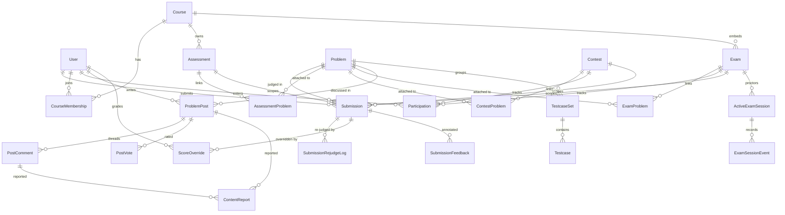

# Database Schema

PostgreSQL 18 with Prisma 7. Schema split across `packages/db/prisma/schema/*.prisma` (auth, clarification, config, contest, course, notification, ops, plagiarism, problem, submission).

> **Field-level reference:** [`DATABASE.generated.md`](./DATABASE.generated.md)
> is an auto-generated, exhaustive table of every model, field, and enum.
> Regenerate it with `pnpm db:docs` after any schema change. This doc keeps
> the curated prose and diagrams. CI fails if the generated file drifts from
> the schema (see the `db:docs` diff gate), so it stays in sync mechanically.

## Domain Model Overview

```
User ──┬── Session
       ├── Account (OAuth: GitHub, Google)
       ├── Submission ──→ Problem
       ├── Participation ──→ Contest | Exam (type = contest | exam | virtual)
       ├── CourseMembership ──→ Course
       ├── ProblemPost ──→ PostComment / PostVote / ContentReport
       └── IpViolationLog

Problem ──┬── ProblemStatement (single statement per problem)
          ├── TestcaseSet ──→ Testcase (standard mode: graded only)
          ├── ProblemWorkspaceFile (per-language files with visibility + editable regions)
          ├── ContestProblem ──→ Contest
          ├── ExamProblem ──→ Exam
          ├── AssessmentProblem ──→ Assessment
          └── ProblemPost (editorial | discussion)

Contest ──┬── ContestProblem
          ├── Participation (type = contest, or virtual for replays)
          └── Submission

Exam ──┬── ExamProblem
       ├── Participation (type = exam; carries ipPin / ipGateExemptUntil)
       ├── Submission
       ├── ActiveExamSession ──→ ExamSessionEvent
       └── IpViolationLog

Course ──┬── CourseMembership
         ├── Assessment ──┬── AssessmentProblem
         │                     └── Submission
         ├── Exam (course-embedded)
         └── Submission
```

## Entity-Relationship Diagram

Core entities and their cardinalities (auth, i18n, audit-log, and notification
tables omitted for legibility — see `DATABASE.generated.md` for the exhaustive
field-level reference).



## Enums

> These rows are curated by hand. Update them alongside any enum change in `packages/db/prisma/schema/` — the CI drift gate only diffs the generated `DATABASE.generated.md`, not this file.

| Enum                       | Values                                                                                                                                                                                                                            |
| -------------------------- | --------------------------------------------------------------------------------------------------------------------------------------------------------------------------------------------------------------------------------- |
| `SupportedLanguage`        | c, cpp, go, java, javascript, python, rust, typescript                                                                                                                                                                            |
| `SubmissionStatus`         | pending_upload, queued, compiling, running, accepted, wrong_answer, time_limit_exceeded, memory_limit_exceeded, runtime_error, compile_error, system_error                                                                        |
| `ProblemType`              | full_source, multi_file, special_env                                                                                                                                                                                              |
| `ProblemDifficulty`        | easy, medium, hard                                                                                                                                                                                                                |
| `ProblemVisibility`        | public, private                                                                                                                                                                                                                   |
| `ProblemStatus`            | draft, published                                                                                                                                                                                                                  |
| `WorkspaceFileVisibility`  | editable, readonly, hidden                                                                                                                                                                                                        |
| `PlatformRole`             | admin, teacher, student                                                                                                                                                                                                           |
| `UserStatus`               | active, disabled, pending_first_login                                                                                                                                                                                             |
| `CourseRole`               | teacher, ta, student                                                                                                                                                                                                              |
| `CourseMembershipStatus`   | active, removed                                                                                                                                                                                                                   |
| `AssessmentStatus`         | draft, published                                                                                                                                                                                                                  |
| `AssessmentAuditAction`    | publish, revert_to_draft, delete_draft                                                                                                                                                                                            |
| `ContestVisibility`        | draft, published                                                                                                                                                                                                                  |
| `ContestScoringMode`       | problem_count, weighted_count, point_sum                                                                                                                                                                                          |
| `ParticipationType`        | contest, exam, virtual (discriminator on the unified `Participation` model; `status` is a `String`, not a Prisma enum)                                                                                                            |
| `ExamStatus`               | draft, published                                                                                                                                                                                                                  |
| `ExamScoringMode`          | problem_count, point_sum                                                                                                                                                                                                          |
| `ExamSessionReleaseReason` | submitted, time_up, released_by_instructor                                                                                                                                                                                        |
| `ExamSessionEventType`     | enter, leave, visibility_lost, release, auto_close, heartbeat                                                                                                                                                                     |
| `IpViolationMode`          | block, notify                                                                                                                                                                                                                     |
| `IpViolationType`          | whitelist, binding                                                                                                                                                                                                                |
| `ScoreboardMode`           | hidden, live, frozen                                                                                                                                                                                                              |
| `AnnouncementStatus`       | draft, published, archived                                                                                                                                                                                                        |
| `AnnouncementAudience`     | all, students, teachers                                                                                                                                                                                                           |
| `PlagiarismReportStatus`   | pending, running, completed, failed                                                                                                                                                                                               |
| `PlagiarismContext`        | assessment, exam, contest                                                                                                                                                                                                         |
| `OverrideContextType`      | assignment, exam, contest                                                                                                                                                                                                         |
| `ScoreOverrideAction`      | create, update, delete                                                                                                                                                                                                            |
| `SubmissionFeedbackAction` | create, update, delete                                                                                                                                                                                                            |
| `ProblemPostType`          | editorial, discussion                                                                                                                                                                                                             |
| `ContentReportStatus`      | open, resolved, dismissed                                                                                                                                                                                                         |
| `ClarificationContextType` | contest, exam, assignment                                                                                                                                                                                                         |
| `ClarificationState`       | pending, answered, dismissed                                                                                                                                                                                                      |
| `NotificationType`         | assignment_started, assignment_due_soon, exam_starting_soon, contest_starting_soon, course_enrolled, announcement_published, role_changed, clarification_answered, editorial_removed (legacy rows), post_removed, comment_removed |

`JudgeType` (`standard` / `checker` / `interactive`) is NOT a Prisma enum — it's a Zod discriminator on the `judgeConfig` JSON column. See `packages/core/src/schemas/judge-config.ts`.

## Key Models

### User

Central identity. Links to sessions, OAuth accounts, submissions, course memberships, contest participations, and stats.

| Field             | Type         | Notes                                                                                                             |
| ----------------- | ------------ | ----------------------------------------------------------------------------------------------------------------- |
| `email`           | String       | Unique                                                                                                            |
| `username`        | String?      | Unique, optional until profile completion                                                                         |
| `displayUsername` | String?      | better-auth display variant of `username` (original-case copy)                                                    |
| `name`            | String       | Required display name (better-auth core field)                                                                    |
| `platformRole`    | PlatformRole | Default: student. `admin` grants admin capability (exercised only via the session admin-mode toggle)              |
| `isSuperAdmin`    | Boolean      | Default: false. `true` only when `platformRole = admin`; super admins grant/revoke admin and require 2FA at login |
| `status`          | UserStatus   | active / disabled / pending_first_login — see schema/auth.prisma for the placeholder-user flow                    |
| `disabled`        | Boolean      | Admin soft-lock used by better-auth sign-in checks                                                                |

### Problem

| Field                   | Type              | Notes                                                                                                                                                                                                                                     |
| ----------------------- | ----------------- | ----------------------------------------------------------------------------------------------------------------------------------------------------------------------------------------------------------------------------------------- |
| `id`                    | String            | CUID, primary key                                                                                                                                                                                                                         |
| `displayId`             | Int?              | Unique human-friendly number ("#N") shown in the UI. Null while a draft; assigned `max(displayId)+1` (under an advisory lock) the first time the problem is published, then never changes. Routes/foreign keys use `id` (cuid), not this. |
| `title`                 | String            | Problem title                                                                                                                                                                                                                             |
| `visibility`            | ProblemVisibility | public or private (course-only)                                                                                                                                                                                                           |
| `status`                | ProblemStatus     | draft or published                                                                                                                                                                                                                        |
| `type`                  | ProblemType       | full_source, multi_file, or special_env                                                                                                                                                                                                   |
| `difficulty`            | ProblemDifficulty | easy, medium, or hard (dedicated column; NOT a tag)                                                                                                                                                                                       |
| `tags`                  | String[]          | Free-form topic/skill tags (difficulty lives on its own column)                                                                                                                                                                           |
| `timeLimitMs`           | Int               | Execution time limit (per-case for standard, total for special_env)                                                                                                                                                                       |
| `memoryLimitMb`         | Int               | Memory limit                                                                                                                                                                                                                              |
| `judgeConfig`           | Json?             | Unified judge configuration (ignored when `type === "special_env"`)                                                                                                                                                                       |
| `samples`               | Json?             | `{ input, output }[]` sample I/O pairs                                                                                                                                                                                                    |
| `advancedConfig`        | Json?             | special_env only — `{ run, grade, network }`; run/grade are `{ imageRef, imageSource }` (digest-pinned registry ref)                                                                                                                      |
| `advancedRequiredPaths` | String[]          | special_env only — paths the TA image expects (trailing `/` = directory marker)                                                                                                                                                           |

### Submission

| Field                     | Type             | Notes                                                                                                                                                                     |
| ------------------------- | ---------------- | ------------------------------------------------------------------------------------------------------------------------------------------------------------------------- |
| `status`                  | SubmissionStatus | Upload / judge progress / verdict. `pending_upload` is the post-DB, pre-S3 staging state; `system_error` is the terminal platform-fault verdict                           |
| `score`                   | Int              | Points awarded; scale is the problem's subtask-weight sum (sum of testcase-set weights, or 100 when unweighted), not a fixed 0-100                                        |
| `examId`                  | String?          | FK to `Exam` when the submission was made inside an exam                                                                                                                  |
| `contestId`               | String?          | FK to `Contest` when the submission was made inside a contest                                                                                                             |
| `participationId`         | String?          | FK to `Participation` — set for virtual-contest replays (carries the per-user `type = virtual` participation row)                                                         |
| `courseId`                | String?          | FK to `Course` (set alongside `assessmentId` for homework)                                                                                                                |
| `assessmentId`            | String?          | FK to `Assessment` when the submission was made for a homework assignment                                                                                                 |
| `sampleOnly`              | Boolean          | `true` for in-editor sample runs — never graded                                                                                                                           |
| `sourceStoragePrefix`     | String           | `@nojv/storage` prefix for the per-file source blobs (`submissions/<id>/sources/`). One S3 object per submitted file. There is no `sourceCode` column                     |
| `verdictSummary`          | Json?            | Small (< 4 KB) summary: `{ caseSummary: { ac, wa, tle, mle, re, other }, subtaskSummary?: { id, score }[], compilerErrorTruncated?: string }`. Safe to load in list views |
| `verdictDetailStorageKey` | String?          | `@nojv/storage` key for the full `SubmissionResult` blob (`submissions/<id>/verdict-detail.json`). Null until the judge writes detail                                     |
| `advancedConfigSnapshot`  | Json?            | special_env only — reserved for a later phase to snapshot the problem's `advancedConfig` at submission time. Currently always null                                        |

"Mode" is not a stored column — it's derived from the FK shape: `examId` ? "exam" : `contestId` ? "contest" : `assessmentId` ? "assignment" : "practice". A DB-level CHECK constraint (`Submission_single_context_chk`, added in migration `20260416180001_submission_single_context_check`) enforces that at most one of `examId` / `contestId` / `assessmentId` is non-null per row. `participationId` sits OUTSIDE this xor — a virtual-contest submission has only `participationId` set (none of the three xor columns).

Indexed on: `[problemId, createdAt]`, `[userId, createdAt]`, `[courseId, assessmentId, createdAt]`, `[contestId, problemId, createdAt]`, `[examId, problemId, createdAt]`, `[participationId, problemId, createdAt]`, `[assessmentId, problemId, createdAt]`, `[status, updatedAt]`, `[problemId, sampleOnly, userId, status]`.

**Source code and verdict detail live in `@nojv/storage`, not the DB.** Submission create writes the DB row first with `status = pending_upload` and `sourceStoragePrefix = submissions/<id>/sources/`, then writes per-file source blobs to S3 via `putSubmissionSources(client, submissionId, sources)`. Once the upload succeeds, the row moves to `queued` and can be dispatched to Temporal. A source upload failure, or a failure while promoting the row to `queued`, deletes any partial source blobs best-effort and marks the row `system_error` so the worker never grades a row whose source prefix is missing or incomplete. The full `SubmissionResult` is written by `putVerdictDetail` at `submissionVerdictDetailKey(submissionId)` = `submissions/<id>/verdict-detail.json` and the small `verdictSummary` JSON + the storage key are persisted on the row. See `packages/storage/src/keys.ts` + `packages/storage/src/submission.ts`.

### Contest

Standalone public / invite-only CP event — no course binding, no proctoring. The 2026-04-14 split moved course-embedded timed assessments out to `Exam`; page lock, IP binding, and IP whitelist live on `Exam` only. Contest features:

- ICPC/IOI scoring modes (`ContestScoringMode`)
- Scoreboard freeze (`frozenBoard` + `frozenAt`) and `ScoreboardMode` (hidden / live / frozen)
- Submit cooldown (`submitCooldownSec`)
- Allowed language restrictions (`allowedLanguages`)
- Optional `inviteCode` (unique) for private invite flows

### Exam

Course-embedded proctored assessment (`courseId` NOT NULL). This is where the proctoring controls live:

- Page lock (`pageLockEnabled`) to prevent multi-tab cheating
- IP whitelist (`ipWhitelistEnabled` + `ipWhitelist`) — empty whitelist while enabled = deny all (fail-closed)
- IP binding (`ipBindingEnabled`) — locks the student to `Participation.ipPin` (the `type = exam` row)
- `IpViolationMode` (block / notify) controls enforcement strength
- `ActiveExamSession` + `ExamSessionEvent` drive the Phase 4 exam lock in `hooks.server.ts`
- `ScoreboardMode`, `submitCooldownSec`, `allowedLanguages` — same shape as Contest

### Assessment

Course-scoped homework only (no proctoring, no scoreboard). Fields:

- Timeline: `opensAt` → `dueAt` (soft, drives late-penalty adjustment rules) → `closesAt` (hard close)
- `maxAttemptsPerDay` per-problem daily cap with a configurable Taipei reset time (`attemptResetMinuteOfDay`, default 300 = 05:00), `allowedLanguages` whitelist
- `adjustmentRules` JSON for late penalty / time bonus / memory penalty

### TestcaseSet / Testcase

Testcases organized into named sets with weights for subtask scoring. Every `TestcaseSet` row is a graded subtask — sample I/O pairs live on `Problem.samples` instead. Each testcase has `input`, `output`, and an ordinal for ordering.

### ProblemWorkspaceFile

Per-language files that make up a Standard Mode problem's workspace. Columns: `language`, `path`, `content`, `visibility` (`editable` / `readonly` / `hidden`), `orderIndex`. Hidden files are never exposed to students but are merged into the sandbox at judge time. Edit access is whole-file: `editable` means the student can replace the file; `readonly` and `hidden` are protected server-side in `mergeSandboxSources()`.

Advanced Mode (`Problem.type === "special_env"`) does not use `TestcaseSet` / `Testcase` rows — the TA-provided Docker image bundles its own testcases and writes a structured `result.json`. See [Judge Pipeline](JUDGE_PIPELINE.md#advanced-mode-pipeline).

### Plagiarism state

Two-part structure:

- **Inline columns on the parent row** (`Assessment`, `Exam`, `Contest`): the six `plagiarism*` columns (`plagiarismStatus`, `plagiarismResults`, `plagiarismReportUrl`, `plagiarismTriggeredAt`, `plagiarismCompletedAt`, `plagiarismTriggeredById`) hold the latest report — one run per parent row, re-running upserts in place. Created by the web endpoint, processed by the Temporal plagiarism activity.
- **`PlagiarismPairFlag` table** (`schema/plagiarism.prisma`): per-pair staff review state — flag a similarity pair as confirmed cheating or false positive, with reviewer + note. Unique key is `(contextType, contextId, pairKey)` where `pairKey` is a server-built deterministic `"${userA}|${userB}|${problemId}"` string with `userA < userB` (sorting prevents inverted-pair double-flagging).

### Clarification

Anonymous, staff-moderated Q&A attached to a `contextType` (contest / exam / assignment) + `contextId`, optionally scoped to a specific `problemId`. `askedByUserId` is always stored for accountability; the API projection masks the asker from non-staff viewers and only staff see the true identity. Lifecycle states: `pending` → `answered` | `dismissed`. `isPublic` (Boolean, default `false`) is the per-answer visibility staff pick when answering: `true` broadcasts to every participant, `false` keeps the answer to the asker only. Non-staff viewers see only their own questions plus public ones; peers are never notified of a question until it is answered publicly. Added by migration `20260702140000_clarification_visibility`, which backfills pre-existing answered rows to `isPublic = true` (they were visible to everyone before). See `packages/db/prisma/schema/clarification.prisma`.

### Notification

One row per event per recipient. `type` is a `NotificationType` enum (e.g. `assignment_due_soon`, `exam_starting_soon`, `clarification_answered`); `params` holds the per-type payload as JSON and the frontend renders user-facing text from `(type, params)` via paraglide. `readAt IS NULL` marks a notification as unread. Written by domain fan-out helpers (e.g. `fanoutExamStartingSoon`) that are typically invoked from Temporal activities. See `packages/db/prisma/schema/notification.prisma`.

## Complete Model Index

46 models in total. The sections above detail the high-traffic / core models; everything else lives here for navigation. For exact column definitions, open the schema file — this table is deliberately one-line-per-model so it stays easy to keep in sync.

| Model                        | Purpose                                                                                                                                                                                                                        | Schema file                   |
| ---------------------------- | ------------------------------------------------------------------------------------------------------------------------------------------------------------------------------------------------------------------------------ | ----------------------------- |
| `User`                       | Central identity (better-auth core + platform role, status, disabled flag)                                                                                                                                                     | `schema/auth.prisma`          |
| `Session`                    | better-auth session row (opaque token, expiry, IP, UA)                                                                                                                                                                         | `schema/auth.prisma`          |
| `Account`                    | better-auth OAuth provider link (GitHub, Google) or password account                                                                                                                                                           | `schema/auth.prisma`          |
| `Verification`               | better-auth email / OTP verification token store                                                                                                                                                                               | `schema/auth.prisma`          |
| `SchoolVerificationToken`    | School-email verification flow (separate from better-auth's Verification)                                                                                                                                                      | `schema/auth.prisma`          |
| `Clarification`              | Staff-moderated Q&A for contests / exams / assignments (asker masked to non-staff; per-answer `isPublic`)                                                                                                                      | `schema/clarification.prisma` |
| `Contest`                    | Standalone public / invite-only CP event — no proctoring fields                                                                                                                                                                | `schema/contest.prisma`       |
| `ContestProblem`             | Join table: problems attached to a contest with ordinal + points                                                                                                                                                               | `schema/contest.prisma`       |
| `Participation`              | Unified per-user state for contest / exam / virtual (`type` discriminator + real `contestId?` / `examId?` FKs; score, penalty, status, subtaskScores, version; exam-only `ipPin` / `ipGateExemptUntil`, virtual-only `endsAt`) | `schema/contest.prisma`       |
| `Exam`                       | Course-embedded proctored exam (page lock, IP whitelist / binding)                                                                                                                                                             | `schema/contest.prisma`       |
| `ExamProblem`                | Join table: problems attached to an exam with ordinal + points                                                                                                                                                                 | `schema/contest.prisma`       |
| `IpViolationLog`             | Audit rows for IP whitelist / binding violations — exam-only                                                                                                                                                                   | `schema/contest.prisma`       |
| `ActiveExamSession`          | Phase 4 exam lock — one row per active `(user, exam)`; `endedAt` closes it                                                                                                                                                     | `schema/contest.prisma`       |
| `ExamSessionEvent`           | Append-only audit log per `ActiveExamSession` (enter / leave / release / …)                                                                                                                                                    | `schema/contest.prisma`       |
| `Course`                     | Course container (title, owner, `academicYear` / `semester`, archived flag)                                                                                                                                                    | `schema/course.prisma`        |
| `CourseMembership`           | `(course, user, role)` with `active` / `removed` status + audit trail                                                                                                                                                          | `schema/course.prisma`        |
| `Assessment`                 | Homework assignment (opens / due / close, adjustment rules, no proctoring)                                                                                                                                                     | `schema/course.prisma`        |
| `AssessmentProblem`          | Join table: problems attached to an assessment with ordinal + points                                                                                                                                                           | `schema/course.prisma`        |
| `AssessmentAuditLog`         | Append-only publish / revert / delete-draft trail for course assessments                                                                                                                                                       | `schema/course.prisma`        |
| `Notification`               | Per-recipient event row (type + params JSON, `readAt` for unread state)                                                                                                                                                        | `schema/notification.prisma`  |
| `Announcement`               | Platform / course announcement (pinned, audience, published window)                                                                                                                                                            | `schema/ops.prisma`           |
| `AnnouncementTranslation`    | Per-locale title + body for an Announcement                                                                                                                                                                                    | `schema/ops.prisma`           |
| `PlagiarismPairFlag`         | Per-pair staff review state (survives plagiarism re-runs)                                                                                                                                                                      | `schema/plagiarism.prisma`    |
| `PlagiarismTriggerLog`       | Append-only log of plagiarism-check triggers (context, triggerer, priorPairCount)                                                                                                                                              | `schema/plagiarism.prisma`    |
| `Problem`                    | Problem metadata (type, difficulty, limits, judge config, samples)                                                                                                                                                             | `schema/problem.prisma`       |
| `ProblemStatement`           | Problem statement body + input / output format (title lives on `Problem.title`)                                                                                                                                                | `schema/problem.prisma`       |
| `TestcaseSet`                | Named subtask on a problem (weight, scoring strategy)                                                                                                                                                                          | `schema/problem.prisma`       |
| `Testcase`                   | Individual graded case (S3 keys for input / output / aux files)                                                                                                                                                                | `schema/problem.prisma`       |
| `ProblemWorkspaceFile`       | Per-language workspace file (path, content S3 key, visibility, order)                                                                                                                                                          | `schema/problem.prisma`       |
| `Submission`                 | Judge submission row (S3 prefix for sources + verdict summary + verdict S3 key, score, mode derived from FKs)                                                                                                                  | `schema/submission.prisma`    |
| `SubmissionRejudgeLog`       | Two-pass audit log for rejudge runs (snapshot of old / new verdict + score)                                                                                                                                                    | `schema/submission.prisma`    |
| `ScoreOverride`              | Staff-only manual score override per `(user, problem, context)`                                                                                                                                                                | `schema/submission.prisma`    |
| `ScoreOverrideAuditLog`      | Append-only create / update / delete trail for `ScoreOverride`                                                                                                                                                                 | `schema/submission.prisma`    |
| `ProblemPost`                | Per-problem community article; `type` = `editorial` (AC-gated) or `discussion` (any signed-in user); title + markdown content, soft-deleted via `deletedAt`                                                                    | `schema/submission.prisma`    |
| `PostVote`                   | Per-`(post, user)` up/down vote (`value`)                                                                                                                                                                                      | `schema/submission.prisma`    |
| `PostComment`                | Two-level comment thread on a post (`parentId` self-relation, max one reply level); soft-delete renders a tombstone                                                                                                            | `schema/submission.prisma`    |
| `ContentReport`              | User-filed report against a post or comment (exactly one target via DB CHECK; open / resolved / dismissed; resolve soft-deletes the target)                                                                                    | `schema/submission.prisma`    |
| `SubmissionFeedback`         | Per-`(context, problem, student)` grader comment on a submission                                                                                                                                                               | `schema/submission.prisma`    |
| `SubmissionFeedbackAuditLog` | Append-only create / update / delete trail for `SubmissionFeedback`                                                                                                                                                            | `schema/submission.prisma`    |
| `ProblemBookmark`            | Per-`(user, problem)` bookmark on the practice problem list                                                                                                                                                                    | `schema/problem.prisma`       |
| `TwoFactor`                  | better-auth TOTP secret + backup codes per user                                                                                                                                                                                | `schema/auth.prisma`          |
| `Passkey`                    | better-auth WebAuthn credential (step-up auth)                                                                                                                                                                                 | `schema/auth.prisma`          |
| `ApiToken`                   | Personal API token (hashed secret, expiry; creation requires 2FA step-up)                                                                                                                                                      | `schema/auth.prisma`          |
| `NotificationPreference`     | Per-user email notification channel opt-ins + lead-day settings                                                                                                                                                                | `schema/notification.prisma`  |
| `AdminAuditLog`              | Append-only trail of admin actions (actor, action, target, summary)                                                                                                                                                            | `schema/ops.prisma`           |
| `PlatformSetting`            | Key/value platform settings store (e.g. stale-submission pending timeout)                                                                                                                                                      | `schema/ops.prisma`           |

Deep field-level detail intentionally stays in the Prisma schema files themselves — treat the `.prisma` file as the source of truth for column types, defaults, indexes, and FK cascade rules.

## JSON Columns

| Model.Field                   | Schema                | Purpose                                                                                                                    |
| ----------------------------- | --------------------- | -------------------------------------------------------------------------------------------------------------------------- |
| `Problem.judgeConfig`         | `JudgeConfig`         | type / compare / checker / interactor / runtime / subtaskStrategies                                                        |
| `Problem.samples`             | `{ input, output }[]` | Sample I/O pairs rendered on the student problem page                                                                      |
| `Assessment.adjustmentRules`  | `AdjustmentRule[]`    | Late penalty / time bonus / memory penalty rules (applied post-judge)                                                      |
| `Submission.verdictSummary`   | `VerdictSummary`      | Small case-counter + per-subtask summary + truncated compiler error (full detail lives in S3 at `verdictDetailStorageKey`) |
| `Participation.subtaskScores` | Score breakdown       | Per-subtask scores (contest / exam / virtual)                                                                              |
| `*.plagiarismResults`         | Dolos result array    | Similarity pairs (similarity, longest, overlap) on Assessment / Exam / Contest                                             |

## Seed Data

Run `pnpm db:seed` to populate development data. Validation with `pnpm db:seed:validate`.

Seed contents (users / problems / contests / course) are described in [Getting Started](../runbooks/getting-started.md) to avoid duplicating the counts in two places. Course enrollment is teacher-managed — there are no join tokens.

## Related Docs

- [Architecture Overview](./ARCHITECTURE.md)
- [Judge Pipeline](./JUDGE_PIPELINE.md)
- [Security Requirements](../operations/SECURITY.md)
