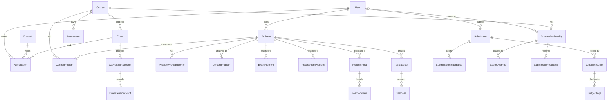

# Database Schema

PostgreSQL 18 with Prisma 7. This page covers the domain model, invariants the
database enforces, JSON column contracts and storage-pointer rules. Every field,
type, enum value, relation and index is in the generated
[DATABASE.generated.md](./DATABASE.generated.md) — regenerate it with
`pnpm db:docs`; CI fails when it drifts from the schema.

## Key code

- `packages/db/prisma/schema/*.prisma` — schema (`auth`, `clarification`, `contest`, `course`, `exam-credential`, `notification`, `ops`, `plagiarism`, `problem`, `submission`; `config.prisma` holds generator/datasource)
- `packages/db/prisma/migrations/` — applied migrations; CHECK constraints and partial indexes live here
- `packages/db/src/repositories/` — the only data-access surface (DAT-01); `src/index.ts` also exports `runTransaction`, `Prisma` and `prismaAdapterClient` (better-auth only)
- `packages/db/prisma/seed.ts`, `prisma/seeds/` — development seed
- `scripts/check-migrations.mjs` (`pnpm lint:migrations`) — migration naming and expand/contract guard
- `scripts/generate-schema-docs.mjs` — generates `DATABASE.generated.md`

Commands: `pnpm db:generate`, `pnpm db:push` (dev), `pnpm db:migrate`,
`pnpm db:deploy`, `pnpm db:validate`, `pnpm db:docs`, `pnpm db:seed`,
`pnpm db:seed:validate`. Seed contents: [Getting Started](../runbooks/getting-started.md).
Production migration and schema-contract fences:
[Deployment](../operations/DEPLOYMENT.md) (OPS-05).

## Domain model

| Area               | Models (schema file)                                                                                                                       |
| ------------------ | ------------------------------------------------------------------------------------------------------------------------------------------ |
| Identity and auth  | `User`, `Session`, `Account`, `Verification`, `TwoFactor`, `Passkey`, `ApiToken`, `RegistryCredential`, `SchoolVerificationToken` (`auth`) |
| Exam credentials   | `ExamCredential`, `ExamCredentialSession` (`exam-credential`)                                                                              |
| Problems           | `Problem`, `ProblemStatement`, `TestcaseSet`, `Testcase`, `ProblemWorkspaceFile`, `ProblemBookmark` (`problem`)                            |
| Submissions        | `Submission`, `JudgeExecution`, `JudgeStage`, `SubmissionRejudgeLog`, `CodeDraft` (`submission`)                                           |
| Grading            | `ScoreOverride`, `ScoreOverrideAuditLog`, `SubmissionFeedback`, `SubmissionFeedbackAuditLog` (`submission`)                                |
| Community          | `ProblemPost`, `PostVote`, `PostComment`, `ContentReport` (`submission`)                                                                   |
| Contests and exams | `Contest`, `ContestProblem`, `Exam`, `ExamProblem`, `Participation`, `ActiveExamSession`, `ExamSessionEvent`, `IpViolationLog` (`contest`) |
| Courses            | `Course`, `CourseMembership`, `CourseProblem`, `Assessment`, `AssessmentProblem`, `AssessmentAuditLog` (`course`)                          |
| Q&A, notifications | `Clarification` (`clarification`); `Notification`, `NotificationPreference` (`notification`)                                               |
| Plagiarism         | `PlagiarismPairFlag`, `PlagiarismTriggerLog` (`plagiarism`); latest report is inline on `Assessment` / `Exam` / `Contest`                  |
| Operations         | `DurableWork`, `Announcement`, `AnnouncementTranslation`, `PlatformSetting`, `AdminAuditLog` (`ops`)                                       |

`Assessment` is the course assignment (homework) model; UI and APIs call it
"assignment". Contests are standalone; exams are course-embedded and carry all
proctoring controls (ASM-01). IDs are cuids; `Problem.displayId` is display-only
(DAT-02, PRB-07).

```mermaid
erDiagram
    User ||--o{ Submission : submits
    User ||--o{ Problem : owns
    User |o--o{ CourseMembership : "binds to"
    User ||--o{ Participation : enters
    Course ||--o{ CourseMembership : has
    Course ||--o{ Assessment : owns
    Course ||--o{ Exam : embeds
    Course ||--o{ CourseProblem : lists
    Problem ||--o{ CourseProblem : "shared with"
    Problem ||--o{ TestcaseSet : groups
    TestcaseSet ||--o{ Testcase : contains
    Problem ||--o{ ProblemWorkspaceFile : has
    Problem ||--o{ ContestProblem : "attached to"
    Problem ||--o{ ExamProblem : "attached to"
    Problem ||--o{ AssessmentProblem : "attached to"
    Contest ||--o{ Participation : tracks
    Exam ||--o{ Participation : tracks
    Exam ||--o{ ActiveExamSession : proctors
    ActiveExamSession ||--o{ ExamSessionEvent : records
    Submission ||--o{ JudgeExecution : "judged by"
    JudgeExecution ||--o{ JudgeStage : checkpoints
    Submission ||--o{ SubmissionRejudgeLog : audits
    CourseMembership ||--o{ ScoreOverride : "graded as"
    CourseMembership ||--o{ SubmissionFeedback : receives
    Problem ||--o{ ProblemPost : "discussed in"
    ProblemPost ||--o{ PostComment : threads
```

## Database-enforced invariants

| Constraint                                                                                                      | Rule                                                                                                                                                                   |
| --------------------------------------------------------------------------------------------------------------- | ---------------------------------------------------------------------------------------------------------------------------------------------------------------------- |
| `Submission_canonical_context_chk`                                                                              | Exactly one shape: practice (no context FKs), assignment (`assessmentId` + `courseId`), exam (`examId`), contest (`contestId`) or virtual (`participationId`) (DAT-03) |
| Composite FKs `(assessmentId, courseId)`, `(participationId, userId)`                                           | Assignment submissions match their course; virtual submissions belong to the participation owner                                                                       |
| `Participation_single_context_chk`, `Participation_ip_exam_only_chk`, `Participation_virtual_window_chk`        | One contest/exam context per row; `ipPin`/`ipGateExemptUntil` only on exam rows; virtual rows carry a valid window (DAT-04)                                            |
| `ActiveExamSession_one_active_per_user_key` (partial unique on `endedAt IS NULL`)                               | At most one active exam session per user; rows are unique per `(userId, examId)` and reused                                                                            |
| `CourseMembership_identity_chk`, `CourseMembership_pending_username_chk`                                        | Exactly one of `userId` / `pendingUsername`; pending usernames match `^[a-z0-9._-]{3,64}$`                                                                             |
| `ScoreOverride_single_context_chk`, `SubmissionFeedback_single_context_chk` (+ audit logs)                      | Exactly one of `assessmentId` / `examId`; contests take neither (ASM-17)                                                                                               |
| `ContentReport_target_check`                                                                                    | A report targets exactly one post or comment                                                                                                                           |
| `*_storage_pointer_chk`                                                                                         | Storage pointer JSON has the pointer shape on `Submission`, `Testcase`, `ProblemWorkspaceFile`, `Problem` checker/interactor                                           |
| `Problem_storage_accounting_chk`, `Submission_judge_generation_chk`, `User_security_generation_nonnegative_chk` | Non-negative storage accounting and generation counters                                                                                                                |
| `*_effective_time_window_chk`, `*_schedule_identity_chk` (`Assessment`, `Contest`, `Exam`)                      | Valid schedule windows and lifecycle schedule identity                                                                                                                 |
| `AssessmentProblem_points_nonnegative`, `ExamProblem_points_nonnegative`                                        | Allocated points are ≥ 0                                                                                                                                               |
| `ExamCredential_*_check`, `DurableWork_*_chk`                                                                   | Credential material/revision/email status and durable-work state/attempt consistency                                                                                   |

## Models by area

### Submissions and judging

- `status` is `SubmissionStatus`. `pending_upload` is the pre-upload intention;
  `system_error` is the platform-fault verdict and never costs an attempt
  (PRB-16). `score` uses the problem's scale (sum of testcase-set weights, or
  100 when unweighted).
- Sources and verdict detail are in object storage (DAT-06): `sourceStorage`
  points to a manifest of per-file objects, `verdictDetailStorage` to the full
  result; `verdictSummary` is the small list-view summary.
- Creation: the intention row commits first; after the upload, one transaction
  commits object ownership, publishes `sourceStorage`, sets `queued`, creates
  the `JudgeExecution` and enqueues its `DurableWork` dispatch. A failed upload
  marks the row `system_error`.
- `judgeGeneration` / `activeJudgeRunId` identify the current judge run.
  `JudgeExecution` (unique `(submissionId, generation)`, unique `workflowId`)
  holds the immutable snapshot pointer, problem generation, queue class,
  recovery epoch and lease; `state` is a string validated by
  `judgeExecutionStateSchema` (`packages/core/src/judge-execution.ts`).
  `JudgeStage` holds verified per-stage result pointers. Behavior:
  [Judge Pipeline](./JUDGE_PIPELINE.md) (JDG-10, JDG-11).
- `SubmissionRejudgeLog` is unique per `(submissionId, rejudgeRunId)` and keeps
  old/new verdict and score (PRB-18).
- `advancedConfigSnapshot` is an audit record written at judge completion, never
  a judging input; see [Judge Pipeline](./JUDGE_PIPELINE.md).
- `isReferenceSolution` rows are hidden from student history and stats;
  `referenceProblemStorageGeneration` must match the problem's current
  `storageGeneration` for publication (PRB-09).
- User-facing submission reads are scoped in PostgreSQL to the caller's active
  exam session when one exists (ASM-21).
- `CodeDraft` is keyed by `(userId, contextKey, problemId, language)`; exam
  drafts are writable only during that exam's active session (WEB-05).

### Problems

- `authorId` is required with `ON DELETE RESTRICT`; account removal requires an
  ownership transfer or deleting an eligible unused draft (PRB-10).
- `displayId` is null while draft and assigned `max + 1` under an advisory lock
  on first publish, then never changes (PRB-07).
- `visibility` and `adminMayPublish` (one-time owner consent for an admin public
  fork, valid only while the source is private) are separate (PRB-11).
- Forks copy the problem-owned graph in one transaction and reuse immutable
  storage pointers without re-uploading; `forkedFromProblemId` is `SET NULL` on
  delete and forks never synchronize. The source's accepted reference is copied
  as a private reference owned by the fork author.
- `storageGeneration` advances on judge-affecting content changes and pins
  reference validation and judge snapshots.
- Every `TestcaseSet` is a graded subtask (`weight`, `ordinal`); samples live in
  `Problem.samples`, not testcases (PRB-03). `Testcase` and
  `ProblemWorkspaceFile` bodies are storage pointers (PRB-04). Workspace
  `visibility` is `editable` / `readonly` / `hidden`; readonly and hidden files
  are protected server-side at merge time.
- `special_env` problems use `advancedConfig` and `advancedRequiredPaths` and no
  testcase rows (PRB-12, PRB-13).
- `CourseProblem` (PK `(courseId, problemId)`) is the course library. Sharing
  never changes ownership; deleting a course removes its links, and a link
  blocks deleting the problem. `addedByUserId` is null for historical links.

### Courses and grading subjects

- `CourseMembership.id` is the durable grading identity (ASM-04). Binding a
  pending username to an account keeps the membership ID, role, status, creator
  and timestamps. A removed membership stays removed on sign-in, school
  verification or rename. On merge, either row's removal wins except for
  protected owner/teacher memberships. Correcting an unlinked username keeps all
  grading relations; collisions with another membership are rejected.
- `User` with memberships cannot be deleted (`ON DELETE RESTRICT`); accounts
  with graded history are anonymized and disabled (DAT-07).
- `ScoreOverride` and `SubmissionFeedback` are unique per
  `(assessmentId|examId, problemId, courseMembershipId)` and need no
  participation or submission row, so pending students can be graded
  (ASM-17, ASM-18).
- Audit logs keep nullable historical user IDs and `courseMembershipId` /
  `sourceMembershipId` snapshots without foreign keys; `merge` rows explain
  conflict decisions. Deleting or merging a roster row never destroys its
  history (DAT-08).

### Activities (assignments, exams, contests)

- Activity settings are inline columns per table (DAT-05).
- `Assessment`: `opensAt` → optional `dueAt` → `closesAt` (hard close);
  `maxAttemptsPerDay` with `attemptResetMinuteOfDay` (null → 300, 05:00 Taipei);
  `allowedLanguages`; `adjustmentRules` (ASM-12, ASM-13).
- `Exam`: `courseId` required; `pageLockEnabled`, `ipWhitelistEnabled` +
  `ipWhitelist` (empty while enabled denies all), `ipBindingEnabled` (pins
  `Participation.ipPin`), `IpViolationMode`, optional `dueAt` + `adjustmentRules`
  late policy, `examPasswordEnabled` (default off; `examPasswordLockedAt` is set
  permanently by the first SMTP attempt; disabling before then revokes
  credentials and temporary sessions) (ASM-19–22).
- `Contest`: `scoringMode`, `scoreboardMode` (`hidden` / `live` / `frozen`),
  `frozenBoard` + `frozenAt`, `submitCooldownSec`, `allowedLanguages`, unique
  `inviteCode`, `penaltyMinutesPerWrong` (ASM-08). `Exam` shares
  `scoreboardMode`, `submitCooldownSec`, `allowedLanguages`.
- `Participation` is the unified contest/exam/virtual row (`type`, unique per
  `(type, contestId|examId, userId)`), with optimistic `version` for score
  updates; `score` is `Decimal(18,2)`.
- Activity grading (ASM-16): `AssessmentProblem.points` and `ExamProblem.points`
  are `Decimal(18,8)` allocations; `ContestProblem.points` is `Int`.
  `Assessment.totalPoints` / `Exam.totalPoints` (`Decimal(18,4)`) are always
  recomputed server-side as the sum of allocations. Raw problem scores and
  overrides keep the problem scale. `detachedProblemIds` holds currently
  detached problem IDs for exact reattachment. Specs:
  [assignments](../features/assignments.md), [exams](../features/exams.md).
- `AssessmentAuditLog` records publish / revert / delete-draft and outlives the
  assessment (ASM-14).

### Plagiarism, clarifications, notifications

- The latest plagiarism report is six inline `plagiarism*` columns on
  `Assessment` / `Exam` / `Contest`; re-running overwrites them.
  `PlagiarismPairFlag` is unique per `(contextType, contextId, pairKey)` with
  `pairKey = "{userA}|{userB}|{problemId}"`, `userA < userB`, and survives
  re-runs; `PlagiarismTriggerLog` records each trigger (ASM-24).
- `Clarification` is keyed by `contextType` + `contextId` (optional
  `problemId`); `askedByUserId` is always stored and masked from non-staff;
  `state` is `pending` → `answered` | `dismissed`; `isPublic` is chosen per
  answer (ASM-10, ASM-11).
- `Notification` is one row per event per recipient; the UI renders text from
  `(type, params)`; `readAt IS NULL` means unread. `NotificationPreference`
  holds email opt-ins, lead days and an optional notification address (UI-03,
  WEB-04).

### Operations

- `DurableWork` is the transactional outbox (`@@unique([kind, dedupeKey])`,
  lease and attempt columns); kinds and processing:
  [Architecture](./ARCHITECTURE.md#durable-work-outbox).
- `PlatformSetting` is a key/value store (for example the stale-submission
  timeout). `AdminAuditLog` is append-only.

## JSON columns

Every persisted JSON blob is validated on read (WEB-03).

| Column                                                                                                                                               | Schema                                                                                                 |
| ---------------------------------------------------------------------------------------------------------------------------------------------------- | ------------------------------------------------------------------------------------------------------ |
| `Problem.judgeConfig`                                                                                                                                | `judgeConfigSchema` in `packages/core/src/schemas/judge-config.ts` (PRB-02); ignored for `special_env` |
| `Problem.advancedConfig`                                                                                                                             | `packages/core/src/schemas/advanced-mode.ts`                                                           |
| `Problem.samples`                                                                                                                                    | `{ input, output }[]` in `packages/core/src/schemas/problem.ts`                                        |
| `Assessment.adjustmentRules`, `Exam.adjustmentRules`                                                                                                 | `packages/core/src/schemas/assessment-adjustments.ts`                                                  |
| `Submission.verdictSummary`                                                                                                                          | `verdictSummarySchema` in `packages/core/src/schemas/submission.ts`                                    |
| `*Storage` pointers (`Submission`, `Testcase`, `ProblemWorkspaceFile`, `Problem` checker/interactor, `JudgeExecution.snapshot`, `JudgeStage.result`) | `StorageObjectPointer` in `packages/storage/src/object.ts`                                             |
| `Participation.subtaskScores`                                                                                                                        | Per-problem subtask scores written by the scoring code in `packages/application/src/scoring/`          |
| `*.plagiarismResults`                                                                                                                                | Dolos pair results, `packages/application/src/plagiarism/types.ts`                                     |
| `Notification.params`                                                                                                                                | Per-`NotificationType` payload                                                                         |
| `DurableWork.payload`                                                                                                                                | Parsed by the handler for its `kind`                                                                   |
