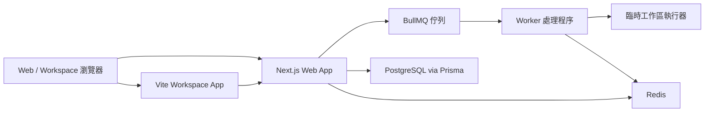

# NOJV POC 架構報告

## 執行摘要

此 POC 現在涵蓋了所有要求的產品領域，並至少提供一個真實的端到端路徑：

- 在 Next.js 中實現 LeetCode 風格的瀏覽器內編輯器
- 透過 BullMQ 和 worker 執行隔離的 `make` / 命令執行
- 獨立的競賽介面
- 防作弊證據擷取、評分、持久化和審核人員計數器
- Claude 風格的 UI 設計
- GCP 部署啟動器

這仍然是一個 POC，而非可用於生產環境的 OJ。關鍵差異在於它不再只是一個 UI 腳手架。佇列、worker、Redis、Prisma、PostgreSQL、Zod 契約、i18n、ECharts、Tailwind、Docker Compose 和 CI 現在都在可運行的切片中處於活動狀態。

## 功能覆蓋

| 需求                       | POC 實現                                                                                                                                                                                                        |
| -------------------------- | --------------------------------------------------------------------------------------------------------------------------------------------------------------------------------------------------------------- |
| 瀏覽器內編輯器             | `apps/web` 問題詳情頁使用 Monaco 編輯器，位於 [`apps/web/src/components/problem-editor.tsx`](/Users/takala/code/NOJV/apps/web/src/components/problem-editor.tsx)                                                |
| 隔離 makefile / 命令工作區 | `apps/workspace` 將文件 + 命令發送到 `/api/workspace/runs`；worker 在 [`apps/worker/src/services/ephemeral-workspace.ts`](/Users/takala/code/NOJV/apps/worker/src/services/ephemeral-workspace.ts) 中具體化它們 |
| 獨立競賽區域               | 專用競賽列表/詳情路由位於 [`apps/web/src/app/[locale]/contests`](/Users/takala/code/NOJV/apps/web/src/app/%5Blocale%5D/contests)                                                                                |
| 防作弊流程                 | 編輯器遙測、工作區策略違規、共享評分、持久化信號/案例、運行時計數器                                                                                                                                             |
| Claude 原生設計            | 共享 token 位於 [`packages/ui/src/index.ts`](/Users/takala/code/NOJV/packages/ui/src/index.ts)                                                                                                                  |
| GCP 部署                   | 啟動器清單位於 [`infra/gcp`](/Users/takala/code/NOJV/infra/gcp)                                                                                                                                                 |

## 必需技術堆疊覆蓋

| 堆疊項目            | POC 中的活躍使用                                                                                                                                           |
| ------------------- | ---------------------------------------------------------------------------------------------------------------------------------------------------------- |
| Vite                | 隔離的工作區客戶端位於 [`apps/workspace`](/Users/takala/code/NOJV/apps/workspace)                                                                          |
| Next.js             | 平台 UI 和 API 位於 [`apps/web`](/Users/takala/code/NOJV/apps/web)                                                                                         |
| ESLint / Prettier   | 根目錄驗證和 CI                                                                                                                                            |
| Tailwind CSS        | 跨 web 和 workspace 的樣式                                                                                                                                 |
| PostgreSQL / Prisma | 透過 [`apps/web/src/lib/server/poc-persistence.ts`](/Users/takala/code/NOJV/apps/web/src/lib/server/poc-persistence.ts) 持久化提交、工作區運行、信號和案例 |
| Redis               | BullMQ 後端                                                                                                                                                |
| BullMQ              | 提交、工作區、完整性佇列                                                                                                                                   |
| Docker Compose      | 本地基礎設施和服務佈局                                                                                                                                     |
| ECharts             | 儀表板圖表位於 [`apps/web/src/components/metric-trend-chart.tsx`](/Users/takala/code/NOJV/apps/web/src/components/metric-trend-chart.tsx)                  |
| Zod                 | 共享契約位於 [`packages/domain/src/index.ts`](/Users/takala/code/NOJV/packages/domain/src/index.ts)                                                        |
| i18n                | `en` 和 `zh-TW` 文案位於 [`packages/i18n/src/index.ts`](/Users/takala/code/NOJV/packages/i18n/src/index.ts)                                                |

## 架構設計

### Web 層

- 負責問題瀏覽、競賽瀏覽、完整性儀表板和路由處理器。
- 在將工作加入佇列之前使用 Zod 契約。
- 在當前 POC 中等待佇列結果，以便使用者獲得即時反饋。
- 透過 Prisma 將完成的結果持久化到 PostgreSQL。

### Workspace 層

- 作為獨立的 Vite 應用程式存在，因為終端機式交互和文件編輯不應該與目錄瀏覽屬於相同的用戶體驗介面。
- 將文件有效負載加上命令元數據發送到 web API。
- 將工作區特定的 UI 關注點與公共平台關注點分開。

### Worker 層

- 負責非同步執行關注點。
- 在每次運行的臨時目錄內執行工作區命令。
- 應用共享的防作弊評分規則。
- 將標準化的執行/裁決數據返回給 web 層。

### 資料層

- PostgreSQL 是持久化 POC 記錄的真實來源。
- Prisma 處理架構契約和關聯寫入。
- Redis 是提交、工作區和完整性作業的非同步傳輸。

## 程式碼審查摘要

### 整體評估

當前的程式碼庫對於 POC 來說是連貫的，並且在 `web`、`workspace`、`worker`、`domain` 和 `queue` 之間有良好的分離。主要的剩餘風險不是基本的正確性錯誤，而是生產環境形態的關注點：同步請求等待、硬編碼演示身份和有限的防作弊偵測器廣度。

### 在此次審查中修復的問題

- 完整性信號持久化不再將批次中的每個信號附加到第一個會話。
- 競賽參與持久化不再在每次更新時重寫 `startedAt`。
- 持久化身份欄位現在在派生處理和電子郵件之前清理用戶 ID。

### 殘留風險

#### P1

1. `web` API 路由同步等待 BullMQ 作業完成。
   影響：長時間的評測作業會佔用 HTTP 請求槽，使 web 在負載下的水平擴展效率降低。
   建議：在生產前將提交和工作區運行切換到非同步建立 + 輪詢/訂閱語義。

2. POC 仍在提交和工作區持久化中使用演示身份。
   影響：多用戶正確性、授權和競賽席位完整性尚未解決。
   建議：新增身份驗證並透過佇列契約傳播真實的使用者/參與 ID。

#### P2

3. 持久化和佇列完成沒有透過 outbox 或單一事務邊界協調。
   影響：worker 成功加上 DB 失敗可能會產生重播或重複寫入的問題。
   建議：將持久化移至 worker 端處理器，或採用 outbox / 事件日誌模式。

4. 防作弊偵測廣度仍處於 POC 層級。
   影響：焦點丟失、貼上突發和 shell 策略是真實的；AST 相似度、IP 漂移和並發會話偵測已準備好架構，但尚未完全自動化。
   建議：新增具有自己測試和可重播證據的偵測器特定服務。

## 潛在故障模式

### 正確性

- 未知的演示問題或競賽 slug 現在會明確失敗，而不是靜默創建記錄。
- `timed_out` 工作區結果目前被折疊到持久化的 `failed` 中，因為 Prisma 枚舉尚未包含超時特定狀態。
- 如果調用者混合了使用者，單個 API 請求仍然可以將不相關的信號批次處理在一起；當前 UI 不會這樣做，但 API 形狀允許。

### 安全性

- 命令執行已經拒絕 shell 元字元並使用許可清單，這降低了明顯的 shell 注入風險。
- 執行器仍然是臨時目錄隔離模型，而不是強化的容器沙箱。對於本地 POC 來說是可接受的，但對於惡意網際網路流量則不行。
- 還沒有身份驗證、RBAC、速率限制或租戶隔離。

### 可靠性

- Web 節點請求/回應時間目前與 worker 延遲耦合。
- Redis 是單一佇列依賴；如果 Redis 停滯，提交和遙測也會停滯。
- Prisma 寫入發生在佇列完成之後，因此寫入放大會增加請求延遲。

## 可擴展性分析

### 已經能夠合理擴展的部分

- `web` 大部分是無狀態的，可以在負載均衡器後面水平擴展。
- `workspace` 目前是靜態 Vite 客戶端，因此前端資產服務可以輕鬆擴展。
- `worker` 實例可以水平擴展，因為 BullMQ 消費者天然支援多副本。
- Redis 佇列分區已經透過提交、工作區運行和完整性信號的獨立佇列名稱在概念上存在。

### 在高流量下首先會崩潰的部分

1. `web` 中的 HTTP 請求持續時間
   因為路由等待作業完成，請求並發性成為第一個瓶頸。

2. Redis 競爭
   單個 Redis 實例處理所有作業類別的佇列傳輸。工作區流量和完整性突發可能會干擾評測流量。

3. PostgreSQL 寫入壓力
   如果每個編輯器信號都單獨存儲，遙測可能會變得非常寫入密集。

4. 沙箱資源競爭
   一旦許多並發運行到達，一般 worker 處理程序上的臨時目錄執行將無法保護 CPU / 記憶體隔離。

## Kubernetes 適用性

Kubernetes 非常適合目標生產架構，但這並不是因為它神奇地修復了當前的 POC。只有在遵守運行時邊界時才有幫助。

### 推薦的 k8s 分解

- `web` 部署
  - 基於 CPU + 請求延遲的 HPA
  - 無本地狀態
- `workspace` 部署或靜態資產託管
  - 如果稍後新增即時終端機串流，則從靜態客戶端分離網關服務
- `worker` 部署
  - 基於佇列深度/自定義指標的 HPA
  - 按佇列類別分離 worker 池
- `sandbox-executor` 作業或專用隔離運行時池
  - 與 `web` 不是相同的 pod
  - 強制執行 CPU、記憶體、seccomp 和網路策略
- 託管 Redis 和 PostgreSQL
  - 自託管的單一 pod 對於大流量 OJ 來說不夠

### 在大規模流量之前所需的變更

1. 將同步 API 變更為非同步作業建立 + 結果輪詢或串流。
2. 將評測執行與一般 worker pod 分離。
3. 為 PostgreSQL 引入連線池。
4. 新增每個佇列的自動擴展指標。
5. 批次處理或抽樣低價值遙測信號。
6. 新增身份驗證、速率限制和每個使用者/每個競賽的配額。

## GCP 和 k8s 定位

當前 repo 已經包含 GCP Cloud Run 啟動器。這仍然是此 POC 的正確首次部署目標，因為：

- 營運成本低於直接跳到 GKE
- 產品仍有未解決的非同步和沙箱邊界
- Cloud Run 足以應對 `web`、`workspace` 和輕量級 `worker` 切片

僅在以下情況下移至 GKE 或混合模型：

- 沙箱執行需要更嚴格的節點級控制
- 佇列深度和評測並發性超出 Cloud Run 的經濟效益
- 審核人員、競賽和評測流量成為不同的擴展域

## 建議

此 POC 足以展示所要求的架構和堆疊選擇。它還不是生產環境安全的。下一個最高價值的里程碑是：

1. 真實身份驗證 + 參與者身份
2. 非同步提交生命週期，而不是同步等待
3. 強化的容器沙箱執行器
4. 更完整的防作弊偵測器，用於相似度、IP 漂移和並發會話證據
