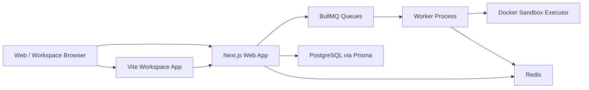

# NOJV POC Architecture Report

## Executive Summary

This POC now covers every requested product area with at least one real end-to-end path:

- LeetCode-style in-browser editing in Next.js
- isolated `make` / command execution through BullMQ and a worker
- separate contest surfaces
- teacher-managed course, assignment, and exam surfaces
- anti-cheat evidence ingestion, scoring, persistence, and reviewer counters
- Claude-inspired UI treatment
- GCP deployment starters

It is still a POC, not a production-ready OJ. The critical difference is that it is no longer only a UI scaffold. The queue, worker, Redis, Prisma, PostgreSQL, Zod contracts, i18n, ECharts, Tailwind, Docker Compose, and CI are now all active in the runnable slice.

## Feature Coverage

| Requirement                           | POC implementation                                                                                                                                                                                                                                                                                                                                                     |
| ------------------------------------- | ---------------------------------------------------------------------------------------------------------------------------------------------------------------------------------------------------------------------------------------------------------------------------------------------------------------------------------------------------------------------- |
| In-browser editor                     | `apps/web` problem detail uses Monaco in [`apps/web/src/components/problem-editor.tsx`](/Users/takala/code/NOJV/apps/web/src/components/problem-editor.tsx)                                                                                                                                                                                                            |
| Isolated makefile / command workspace | `apps/workspace` sends files + command to `/api/workspace/runs`; worker materializes them in [`apps/worker/src/services/ephemeral-workspace.ts`](/Users/takala/code/NOJV/apps/worker/src/services/ephemeral-workspace.ts) and executes them through [`apps/worker/src/services/docker-sandbox.ts`](/Users/takala/code/NOJV/apps/worker/src/services/docker-sandbox.ts) |
| Real testcase judging                 | teacher-authored testcase sets persist in PostgreSQL and submission worker runs compare output inside the sandbox-backed judge path                                                                                                                                                                                                                                    |
| Separate contest area                 | dedicated contest list/detail routes under [`apps/web/src/app/[locale]/contests`](/Users/takala/code/NOJV/apps/web/src/app/%5Blocale%5D/contests)                                                                                                                                                                                                                      |
| Course management                     | course list/detail + assignment/exam pages under [`apps/web/src/app/[locale]/courses`](/Users/takala/code/NOJV/apps/web/src/app/%5Blocale%5D/courses) and course APIs under [`apps/web/src/app/api/courses`](/Users/takala/code/NOJV/apps/web/src/app/api/courses)                                                                                                     |
| Anti-cheat pipeline                   | editor telemetry, workspace policy violations, shared scoring, persisted signals/cases, runtime counters                                                                                                                                                                                                                                                               |
| Claude-native design                  | shared tokens in [`packages/ui/src/index.ts`](/Users/takala/code/NOJV/packages/ui/src/index.ts)                                                                                                                                                                                                                                                                        |
| GCP deployment                        | starter manifests in [`infra/gcp`](/Users/takala/code/NOJV/infra/gcp)                                                                                                                                                                                                                                                                                                  |

## Required Tech Stack Coverage

| Stack item          | Active usage in POC                                                                                                                                                          |
| ------------------- | ---------------------------------------------------------------------------------------------------------------------------------------------------------------------------- |
| Vite                | isolated workspace client in [`apps/workspace`](/Users/takala/code/NOJV/apps/workspace)                                                                                      |
| Next.js             | platform UI and APIs in [`apps/web`](/Users/takala/code/NOJV/apps/web)                                                                                                       |
| ESLint / Prettier   | root verification and CI                                                                                                                                                     |
| Tailwind CSS        | styling across web and workspace                                                                                                                                             |
| PostgreSQL / Prisma | persisted submissions, workspace runs, signals, cases via [`apps/web/src/lib/server/poc-persistence.ts`](/Users/takala/code/NOJV/apps/web/src/lib/server/poc-persistence.ts) |
| Redis               | BullMQ backend                                                                                                                                                               |
| BullMQ              | submission, workspace, integrity queues                                                                                                                                      |
| Docker Compose      | local infra and service layout                                                                                                                                               |
| ECharts             | dashboard chart in [`apps/web/src/components/metric-trend-chart.tsx`](/Users/takala/code/NOJV/apps/web/src/components/metric-trend-chart.tsx)                                |
| Zod                 | shared contracts in [`packages/domain/src/index.ts`](/Users/takala/code/NOJV/packages/domain/src/index.ts)                                                                   |
| i18n                | `en` and `zh-TW` copy in [`packages/i18n/src/index.ts`](/Users/takala/code/NOJV/packages/i18n/src/index.ts)                                                                  |

## Architecture Design

### Web tier

- Owns problem browsing, contest browsing, integrity dashboarding, and route handlers.
- Uses Zod contracts before enqueuing work.
- Returns queued operation IDs immediately and expects the client to poll for completion.
- Persists the completed result into PostgreSQL through Prisma.

### Workspace tier

- Exists as an independent Vite app because terminal-like interaction and file editing do not belong inside the same UX surface as catalog browsing.
- Sends file payloads plus command metadata to the web API.
- Keeps workspace-specific UI concerns separate from public platform concerns.

### Worker tier

- Owns asynchronous execution concerns.
- Runs workspace commands and testcase-based submission judging inside sandboxed execution boundaries.
- Applies shared anti-cheat scoring rules.
- Returns normalized execution / verdict data to the web layer.

### Data tier

- PostgreSQL is the source of truth for persisted POC records.
- Prisma handles schema contracts and relational writes.
- Redis is the async transport for submission, workspace, and integrity jobs.
- Course, membership, join-token, problem-ownership, and assessment relations now sit in the same PostgreSQL schema as judge execution data.

### Course-management tier

- Platform role and course membership are intentionally split.
- `teacher` and `admin` can create courses and problems.
- Course `teacher` / `ta` / `admin` can publish assessments and manage members.
- Assignments and exams share the judge backend while keeping different page framing and operational policy.

## Code Review Summary

### Overall assessment

The current codebase is coherent for a POC and has good separation between `web`, `workspace`, `worker`, `domain`, and `queue`. The main remaining risks are not basic correctness bugs but production-shape concerns: synchronous request waiting, hard-coded demo identity, and limited anti-cheat detector breadth.

### Fixed during this pass

- Integrity signal persistence no longer attaches every signal in a batch to the first session.
- Contest participation persistence no longer rewrites `startedAt` on every update.
- Persistence identity fields now sanitize user IDs before deriving handles and emails.

### Residual risks

#### P1

1. `web` API routes synchronously wait for BullMQ job completion.
   Impact: long judge jobs consume HTTP request slots and make horizontal web scaling less effective under load.
   Recommendation: switch submissions and workspace runs to async create + poll / subscribe semantics before production.

2. The POC still uses a demo identity in submission and workspace persistence.
   Impact: multi-user correctness, authorization, and contest seat integrity are only partially solved through header-driven actor simulation.
   Recommendation: add auth and propagate real user / participation IDs through the queue contract.

#### P2

3. Persistence and queue completion are not coordinated through an outbox or a single transactional boundary.
   Impact: worker success plus DB failure can create replay or duplicate-write concerns.
   Recommendation: move persistence into worker-side processors or adopt an outbox / event log pattern.

4. Anti-cheat detection breadth is still POC-level.
   Impact: focus loss, paste burst, and shell policy are real; AST similarity, IP drift, and concurrent-session detection are schema-ready but not yet fully automated.
   Recommendation: add detector-specific services with their own tests and replayable evidence.

## Potential Failure Modes

### Correctness

- Unknown demo problem or contest slugs now fail explicitly instead of silently inventing records.
- Header-driven actors can still impersonate another role because the POC intentionally lacks real authentication.
- A single API request can still batch unrelated signals together if a caller mixes users; the current UI does not do this, but the API shape allows it.

### Security

- Command execution already rejects shell metacharacters and uses an allowlist, which reduces obvious shell injection risk.
- The executor now uses Docker with CPU, memory, pid, privilege, and network limits. This is a meaningful step forward, but it is still not equivalent to a production-grade multi-tenant sandbox such as gVisor, Firecracker, or a dedicated node pool.
- There is no auth, RBAC, rate limiting, or tenancy isolation yet.

### Reliability

- Web-node request/response time is currently coupled to worker latency.
- Redis is a single queue dependency; if Redis stalls, submissions and telemetry stall.
- Prisma writes occur after queue completion, so write amplification increases request latency.

## Scalability Analysis

### What already scales reasonably

- `web` is mostly stateless and can scale horizontally behind a load balancer.
- `workspace` is a static Vite client today, so front-end asset serving scales trivially.
- `worker` instances can scale horizontally because BullMQ consumers are naturally multi-replica.
- Redis queue partitioning already exists conceptually through separate queue names for submissions, workspace runs, and integrity signals.

### What will break first under high traffic

1. HTTP request duration in `web`
   Because routes wait for job completion, request concurrency becomes the first bottleneck.

2. Redis contention
   A single Redis instance handles queue transport for all job classes. Workspace traffic and integrity bursts can interfere with judge traffic.

3. PostgreSQL write pressure
   Telemetry can become very write-heavy if every editor signal is stored individually.

4. Sandbox resource contention
   Docker limits help, but a shared worker host can still become the noisy-neighbor bottleneck once many concurrent runs arrive.

## Kubernetes Suitability

Kubernetes is a good fit for the target production architecture, but not because it magically fixes the current POC. It helps only if the runtime boundaries are respected.

### Recommended k8s decomposition

- `web` Deployment
  - HPA on CPU + request latency
  - no local state
- `workspace` Deployment or static asset hosting
  - if later adding live terminal streaming, split a gateway service from the static client
- `worker` Deployment
  - HPA on queue depth / custom metrics
  - separate worker pools by queue class
- `sandbox-executor` Jobs or dedicated isolated runtime pool
  - not the same pods as `web`
  - enforce CPU, memory, seccomp, and network policy
- managed Redis and PostgreSQL
  - self-hosted single pods are not enough for high-volume OJ traffic

### Required changes before large-scale traffic

1. Change synchronous APIs into async job creation + result polling or streaming.
2. Separate judge execution from general worker pods.
3. Introduce connection pooling for PostgreSQL.
4. Add per-queue autoscaling metrics.
5. Batch or sample low-value telemetry signals.
6. Add auth, rate limiting, and per-user / per-contest quotas.

## GCP And k8s Positioning

The current repo already includes GCP Cloud Run starters. That remains the right first deployment target for this POC because:

- operational cost is lower than jumping directly to GKE
- the product still has unresolved async and sandbox boundaries
- Cloud Run is enough for `web`, `workspace`, and lightweight `worker` slices

Move to GKE or a mixed model only when:

- sandbox execution needs tighter node-level control
- queue depth and judge concurrency exceed Cloud Run economics
- reviewer, contest, and judge traffic become distinct scaling domains

## Recommendation

This POC is complete enough to demonstrate the requested architecture and stack choices. It is not yet production-safe. The next highest-value milestone is:

1. real auth + participant identity
2. async submission lifecycle instead of synchronous wait
3. stronger sandbox isolation with dedicated runtime nodes or microVM-backed execution
4. fuller anti-cheat detectors for similarity, IP drift, and concurrent-session evidence
